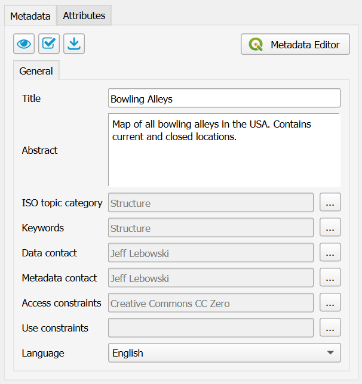
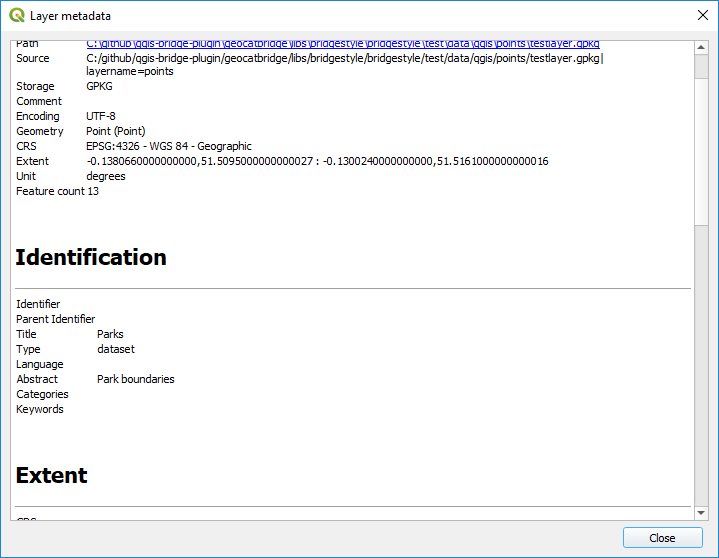
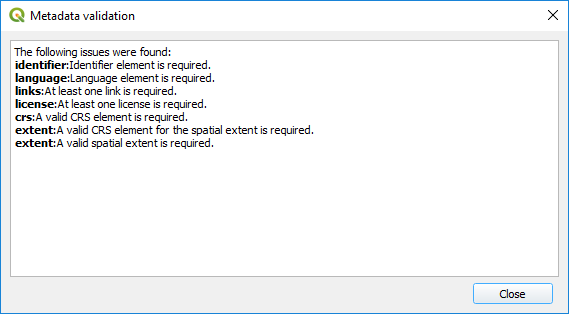
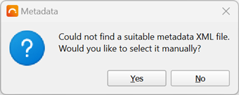

# Metadata Editing

{{ app_name }} provides a basic editor for metadata properties to create
ISO19139-compliant metadata records. The purpose of this editor is to easily
complete a minimal subset of required metadata elements:

-   Title
-   Abstract
-   ISO topic category
-   Keywords
-   Metadata contact
-   Data contact
-   Access constraints (used for data license)
-   Use constraints (also known as Fees)
-   Metadata language

When publishing metadata to GeoNetwork, {{ short_name }} will convert the QGIS metadata (QMD) into the ISO19139 format.
Note that in order to do that, {{ short_name }} uses the `lxml` library, which [may not be installed](server_configuration.md#geonetwork).

You can edit the {{ short_name }} metadata fields directly, or use the QGIS metadata editor by clicking the **Open QGIS metadata editor** button.
Note that you can also click the **...** buttons next to each {{ short_name }} metadata field to open the QGIS metadata editor a specific page:

## Preview metadata

To see a preview of the metadata of the selected layer, click the {: width="16" } button.

This will open a new dialog and render the metadata as a simple HTML webpage:

## Metadata validation

{{ short_name }} can use built-in QGIS validation tools and display the result of the metadata validation.
Click the {: width="16" } button to validate your metadata.

After validation a dialog with the results is displayed:

## Load metadata

If your layer has metadata in ISO19139 or ESRI-ISO (ISO19115 or FGDC) format, and that metadata is available in an auxiliary file stored alongside the data file, QGIS will *not* automatically read it.

QGIS only has native support for its own `qmd` format. However, {{ short_name }} is able to import the metadata.
Select the layer in the {{ short_name }} dialog and click the {: width="16" } button.

{{ short_name }} will look in the folder where the layer file is stored and try to find a metadata file named either `[layer_filename].[extension].xml` or `[layer_filename].xml`.
For example, for a layer data source named `countries.shp`, it will search for both `countries.shp.xml` and `countries.xml`.
If such a file exists, and it is in one of the supported ISO formats mentioned above, {{ short_name }} will convert it into the QGIS metadata format and import all elements that it could find.
If no auxiliary metadata file could be found, {{ short_name }} will ask you if you wish to manually select it:

If you click **Yes**, a file dialog will open so you can select the metadata file to import.

!!! note
    - Some (non-supported) elements of the original metadata may get lost in the transformation.
    - Changes in the metadata editor will not be saved to the original imported metadata file.
    - Because of a [dependency](server_configuration.md#geonetwork), {{ short_name }} may not be able to import metadata.
      If this is the case, a warning will be displayed.

!!! warning
    **If you wish to persist the imported/edited metadata for another time, it is important that you
    save the QGIS project before your close the application.**

    However, within the same QGIS session (i.e. for the time that the application is being used),
    the metadata for each layer will be memorized.
