# Quickstart Tutorial

Once {{ app_name }} has been [installed](installation.md#how-to-install), the first thing you might want to do is publish some layers!

This quickstart tutorial will walk you through the process of publishing a QGIS map layers to GeoServer.

## Setting up a GeoServer connection

Before you can publish *anything* to GeoServer, {{ short_name }} needs to know where your stuff needs to go.
Therefore, you will have to [configure a GeoServer connection](server_configuration.md#geoserver).
This typically *only needs to be done once*, as {{ short_name }} will store all server configurations for future use.

### Step 1: show {{ short_name }} dialog

Find and click the {{ short_name }} button in the QGIS Web Toolbar:

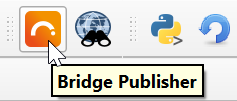

The {{ short_name }} dialog should now appear. First-time users may see the **About** panel, while others will
probably see the **Publish** panel instead.

### Step 2: go to Connections panel

Click on **Connections** in the left sidebar. If no servers have been configured so far, this should show the
following panel:

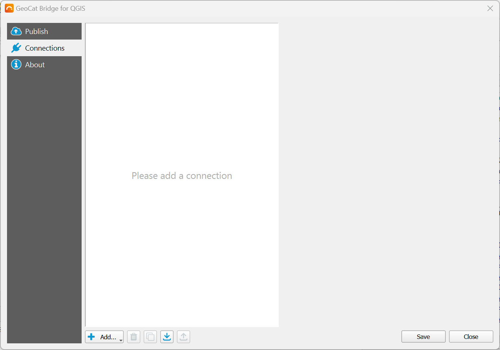

### Step 3: add new connection

Click the {: width="16" } **Add...** button on the lower left corner of the **Connections** panel and select **GeoServer**:

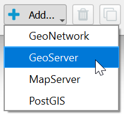

This should create a new GeoServer configuration that will look this this:

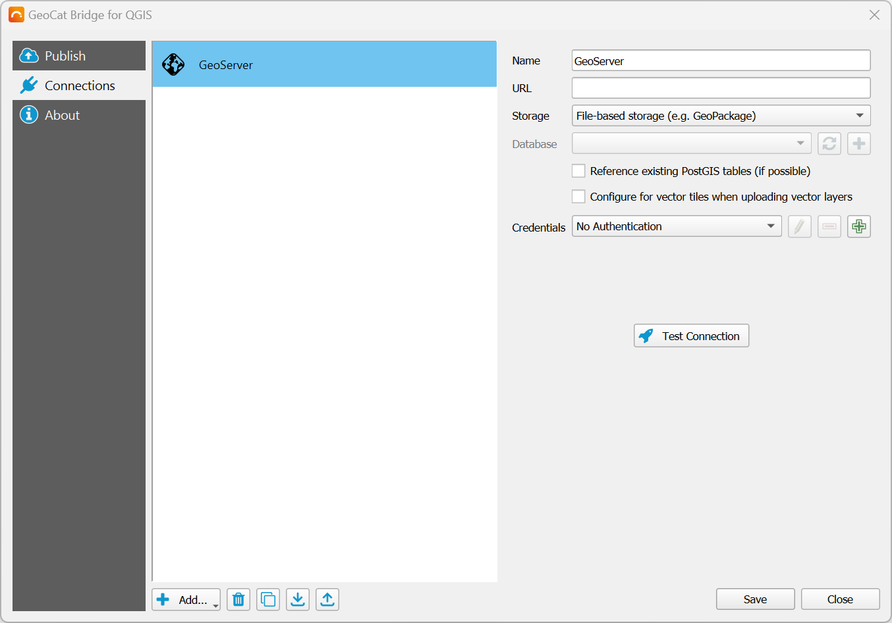

### Step 4: set name and address

Give the configuration a **Name** or use the suggested one. If you are planning on using multiple configurations,
you may want to set a proper name so you can easily identify the configuration in the **Publish** panel later on.

Now, specify the **URL** (host address) to the GeoServer instance you wish to publish to. For example,
for a local GeoServer installation, fill in something like this:

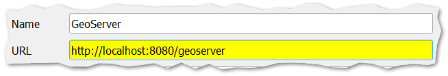

For remote connections, you should probably use a secure connection starting with `https://`.
The port can likely be omitted in this case, unless the remote connection does not use port 80.

### Step 5: confirm storage type

For this quickstart tutorial, we will publish data to a file-based datastore. This means that {{ short_name }} will upload
a GeoPackage, Shapefile, or GeoTIFF file to GeoServer and GeoServer will directly use that file to create a WMS layer for it.
The data will not be stored in a database for example.

When you add a new GeoServer configuration, the **Storage** setting is already set to *File-based storage (e.g. GeoPackage)*,
so we do not need to change anything here.

### Step 6: add new credentials

In order to actually establish a connection, we need to authenticate ourselves with GeoServer.
To do that, add new **Credentials** by clicking the {: width="16" } button:

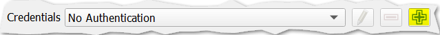

If you have already set GeoServer credentials before, you may select the right one from the dropdown instead and skip the next step.

### Step 7: authentication details

After you clicked the {: width="16" } button in the previous step, the *Authentication* dialog will pop up.

For the authentication mechanism, we will use *Basic authentication*. This is the default and works
well with GeoServer. It also is the only mechanism that {{ short_name }} currently supports.

Now specify any **Name** (to identify your credential settings) and set the **Username**
and **Password** for your GeoServer user:

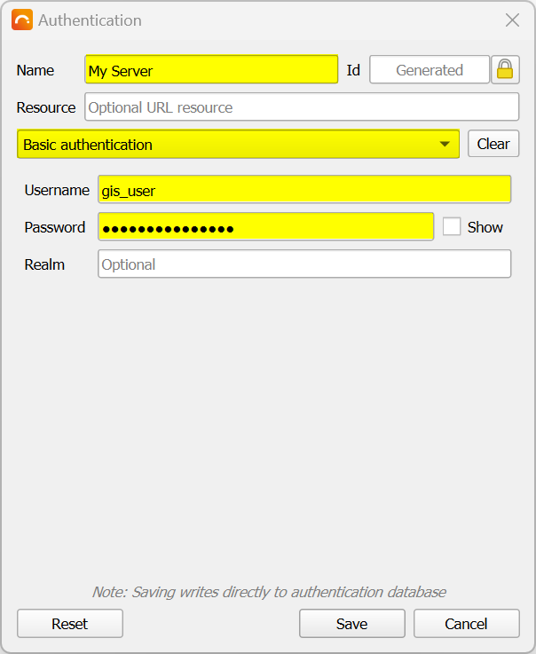

Click **Save** when you're done. The **Credentials** configuration should now be set:

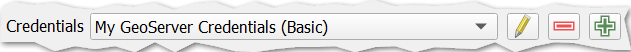

### Step 8: test connection

Now, click the **Test Connection** button to make sure that {{ short_name }} can connect to GeoServer.

If the connection was successful, you should see a green message bar at the top.
If the connection was *not* successful, you should see a red error message, that will likely tell you what went wrong.

### Step 9: save configuration

Save your GeoServer configuration by clicking the **Save** button in the lower right corner of the
**Connections** panel.

You are now ready to publish some layers!

## Publishing QGIS layers to GeoServer

For this guide, we are using [Natural Earth data](https://www.naturalearthdata.com/downloads/), but you
can of course use any data you like.

Before you can publish something, make sure that there are some [publishable layers](publish.md#supported-layer-types)
in your map and that your QGIS project is saved to disk if you have been creating a new map from scratch.
{{ short_name }} currently uses the project name as the GeoServer workspace name to publish to,
but this behavior may change in the future.

### Step 1: open publish dialog

Now, click the {{ short_name }} button in the QGIS Web Toolbar:

The {{ short_name }} dialog should appear, showing the **Publish** panel and all publishable layers. For example:

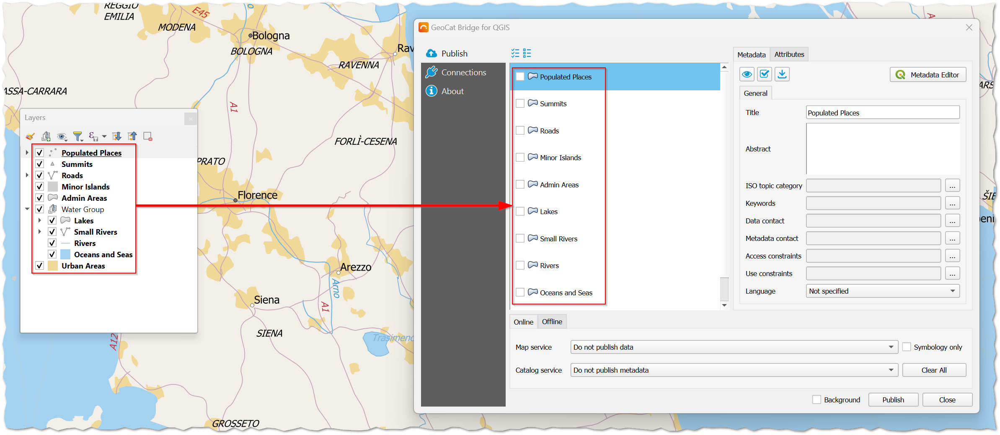

Note that {{ short_name }} shows a "flat" list of layers: group layers are not shown here. However, {{ short_name }} will
automatically create GeoServer group layers for all published layers that have been grouped in QGIS.

### Step 2: select target server

In the **Online** tab at the bottom of the **Publish** panel, set the **Data server** to the
[GeoServer configuration](#setting-up-a-geoserver-connection) that you wish to publish to:

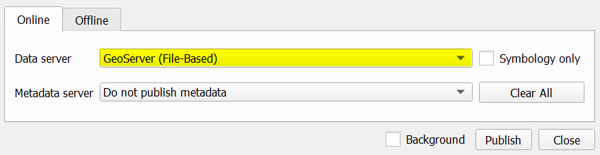

The **Data server** list should display all the names of the configurations that you created in the **Connections** panel.
If you just got started, then there will likely only be 1 item in this list.

### Step 3: select layers

Now it is up to you to decide which layers you wish to publish. You can uncheck the layers you do *not* wish to publish,
or simply publish all of them (default).

Optionally, you can click on a layer and set the *Title* or *Abstract* in the **Metadata** tab.
These fields will be published to the GeoServer workspace layer. Other metadata will be ignored in this case,
but can be published to a catalogue service like GeoNetwork if needed. Also note that if you do *not* set the *Title*,
the layer name as shown in the QGIS Table of Contents is used.

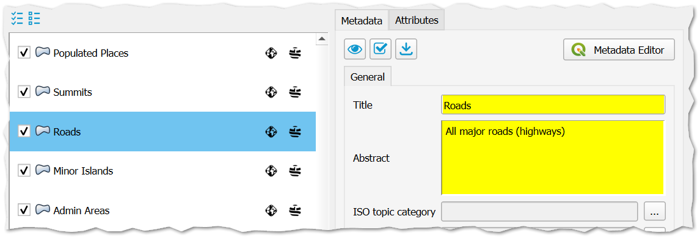

!!! tip
    If you have vector layers with lots of attributes, but you only need to publish a couple of these
    fields, you can select the applicable layer and click on the **Attributes** tab.
    Here you can uncheck all attributes that do *not* need to be published, which will save some storage
    space on the GeoServer side and reduce the time it will take {{ short_name }} to transfer the data.

### Step 4: start publish process

For this tutorial, we will simply go ahead and publish **all layers**. As noted in the previous step, this is the default.

Click the **Publish** button in the lower right corner of the {{ short_name }} dialog to start the publication process.
During this process, a progress dialog should appear:

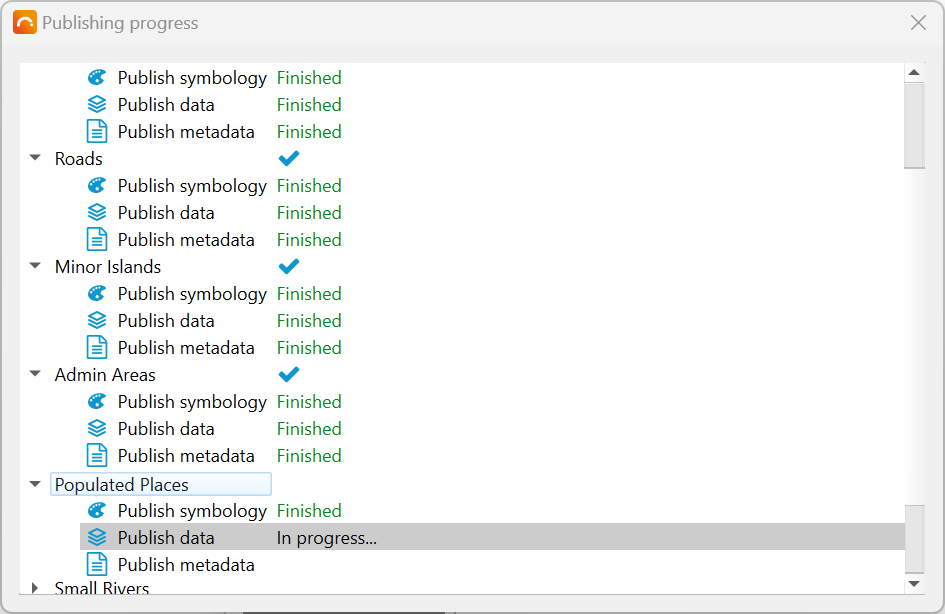

!!! note
    For you (the user) it may seem that {{ short_name }} does not treat *raster* layers differently from *vector* layers.
    Under the hood however, {{ short_name }} will **always** publish *raster* data to a file-based GeoServer datastore
    as GeoTIFF files. *Vector* data on the other hand will be published in the original format (Shapefile,
    GeoPackage) if possible, and can also be imported into a PostGIS datastore.

### Step 5: review results

Once the publish process has completed, a result dialog should appear:

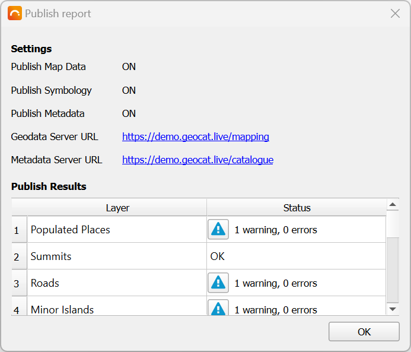

If there are any errors or warnings, these are shown in the **Status** column of the published layer list.
Click on the tiny {: width="16" } buttons to get more details about the issue(s).
If there are no issues, it should say *OK* next to each layer.

Close the result dialog once you finished reviewing.

!!! note
    An issue that often occurs is a warning that the layer name has been renamed by {{ short_name }},
    due to some unsupported characters on the GeoServer side. This often happens when there are spaces
    in the name. If this is the case, then you can safely ignore the warning.
    Also note that this won't affect the layer *title*.

### Step 6: WMS preview

{{ short_name }} should now update the **Publish** panel and display a GeoServer icon behind
each successfully published layer. If you hover over the icon using your mouse, it should also tell you which
server configuration was used.

If you wish to view a browser-based preview of the GeoServer WMS, you can right-click the GeoServer
icon and choose either **View all WMS layers** to preview all layers (i.e. the entire map) in your
GeoServer workspace, or choose **View this WMS layer** to only preview the selected layer:

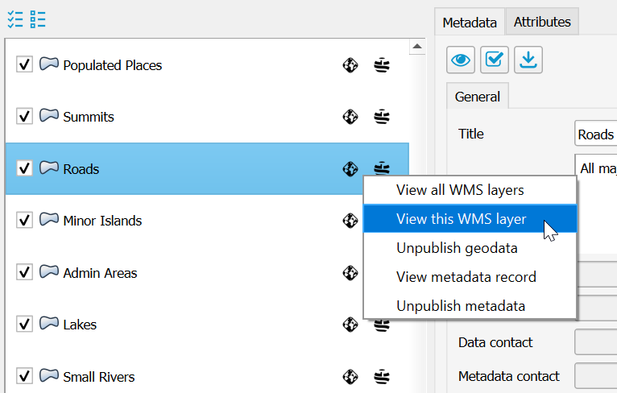

The OpenLayers preview for all layers could for example look like this:

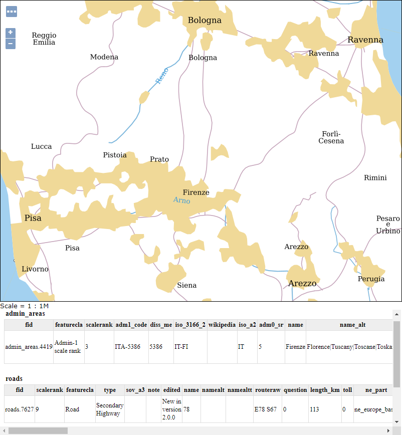

Clicking on any item on the map will display its (published) attributes at the bottom.

!!! note
    Due to the dynamic preview, the layer order may be slightly different than in QGIS.
    Label fonts may also differ from what you see in QGIS if the font is not available on the GeoServer side.
