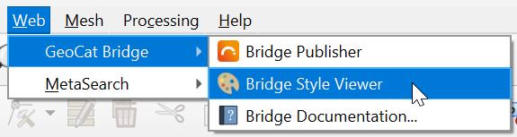
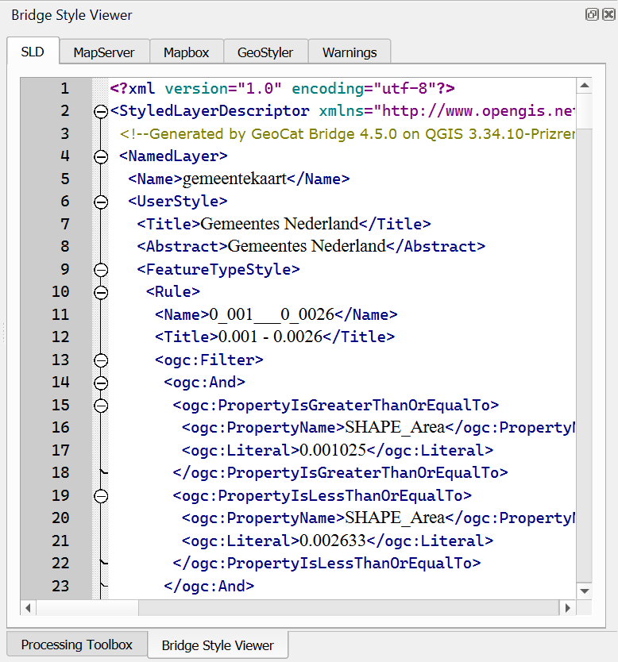

# Style Viewer Panel

{{ app_name }} offers a way to preview a layer style (symbology) in several different formats using the *Style Viewer*.

You can open the *Style Viewer* panel by clicking **Bridge Style Viewer** from the {{ app_name }} menu:

Alternatively, you can open the panel using **View → Panels → Bridge Style Viewer** in the QGIS menu bar.

A dockable panel will now be displayed (initially on the right side of the screen) that looks similar to this:

If you wish to close the *Style Viewer*, click the close button (**x**) in the upper-right corner of the panel
or uncheck the **View → Panels → Bridge Style Viewer** item in the QGIS menu bar.

Currently, *Style Viewer* supports the following style formats:

- SLD (XML): used by GeoServer
- MapServer style (plain text): also known as Mapfile
- Mapbox style (JSON): used for vector tiles
- GeoStyler (JSON)

The *Style Viewer* is context-aware, meaning that it will show style previews for the currently selected layer in the QGIS *Layers* panel:

For more information about how {{ short_name }} handles symbology and which style elements are supported, please read the [Supported Symbology](supported_symbology.md) section.

!!! note
    - If the layer is not supported by {{ short_name }} (see [Supported layer types](publish.md#supported-layer-types)), nothing will be shown.
    - If there were issues during the style conversion process, these will be displayed on the *Warnings* tab.
