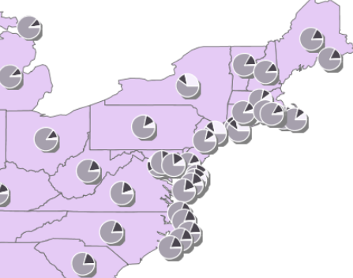

# GeoServer Setup

To use some of the functionality in Bridge GeoServer extensions are
required. You can download the required extensions matching the version
number of your GeoServer installation on the [GeoServer web page](http://geoserver.org/download/).

## ArcSDE

To publish ArcSDE layers to Esri ArcSDE® datastores in GeoServer it is
required to have *GeoServer ArcSDE® datastores* extension installed.
Make sure to install the version of the extension that matches the
version number of your GeoServer installation.

## Chart renderer

To publish chart symbology it is required to have the *Chart Symbolizer*
extension installed. Make sure to install the version of the extension
that matches the version number of your GeoServer installation.

## GeoPackage

GeoServer has support for the GeoPackage format natively starting from
GeoServer version 2.12. To get GeoPackage support on GeoServer with a
version lower than 2.12 install the [GeoPackage
extension](http://docs.geoserver.org/latest/en/user/community/geopkg/)
for GeoServer. Make sure to install the version of the extension that
matches the version number of your GeoServer installation. A
prerequisite for the GeoPackage extension is the Web Processing Service
(WPS) extension, so make sure to first install the WPS extension before
installing the GeoPackage extension.

## Oracle Spatial

To publish layers from an Oracle spatial database to a Oracle spatial
datastore in GeoServer it is required to have the *Oracle*
[extension](http://docs.geoserver.org/latest/en/user/data/database/oracle.html)
installed. Make sure to install the version of the extension that
matches the version number of your GeoServer installation.
