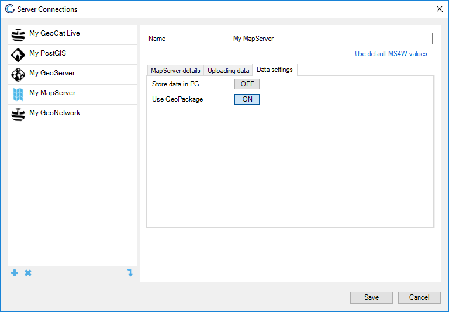
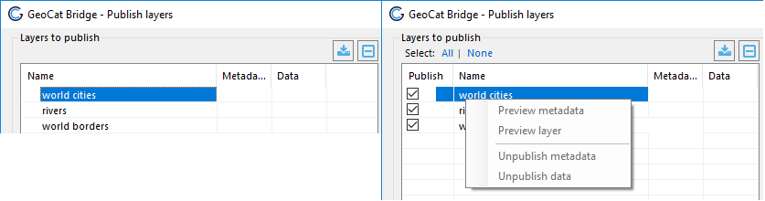
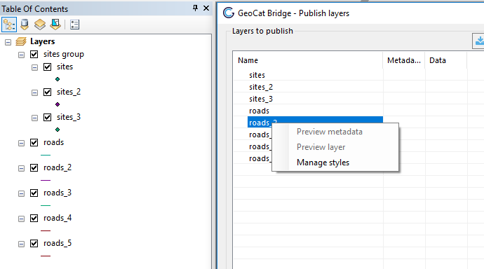
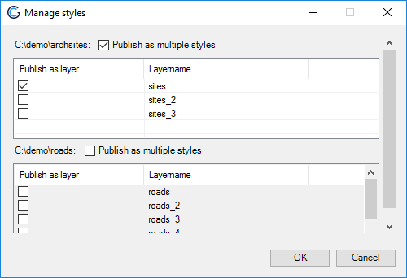

# Bridge Conventions

## Naming

The following section is both valid for GeoServer and MapServer. 

When publishing data Bridge uses the following naming
convention:

-   The ArcMap layer name is used for the layer name, for this
    the ArcMap layer name is escaped to make it a valid WMS/WFS/WCS
    layer name (replacing spaces with underscores, replacing special
    characters with underscores)
-   The ArcMap layer name is used for the layer title. There
    is also the option to use the metadata title of the layer, configure
    this by setting `MetadataTitleAsOWSTitle` configuration parameter,
    see [MetadataTitleAsOWSTitle](6_configuration_extension.html#metadatatitleasowstitle)
-   When using a file based datastore (such as Shapefile, GeoPackage or
    GeoTiff) the name of the datastore will be set to the
    escaped ArcMap layer name
-   The filename of the exported file (Shapefile, GeoPackage or GeoTiff)
    will be set to the escaped ArcMap layer name

note:: Bridge does not use the name of the original dataset on the
server. The reason is that users can decide to apply a filter on a
dataset, so each layer is published as a new dataset to the map server
(this not the case when publishing by reference to an Oracle or ArcSDE
datastore). This can potentially duplicate the data on your
server, if you are creating multiple layers based upon the same data
set.

| Name on the server                    | Names in ArcGIS            |
| ------------------------------------- | -------------------------- |
| WMS/WFS layer name                    | Layer name (escaped)       |
| WMS/WFS layer title                   | Metadata title of dataset  |
| Exported filename                     | Layer name (escaped)       |
| Datastore name (only file based)      | Layer name (escaped)       |

### Example

We have a layer named *\"States US\"* . When the layer *\"States US\"*
is published in a Shapefile datastore this will be the
result:

| Type                                 | Name                       |
| ------------------------------------- | -------------------------- |
| GS layer name                         | States\_US                 |
| GS layer title                        | States US                  |
| Datastore name                        | States\_US                 |
| Shapefile name                        | States\_US                 |

## Publication

### File base data formats

#### GeoServer

When publishing your data to GeoServer, Bridge uses the [GeoPackage](12_geoserver_setup.html#geopackage) format by default. 

If you prefer to use Shapefile as the transport format, you can set the
following `ForceShapefile` configuration option in the Bridge
configuration file to `false`, see [ForceShapefile](6_configuration_extension.html#forceshapefile).

Using GeoPackage you can either publish your data to a *Filebased*
datastore or to a *PostGIS* datastore. When choosing a *Filebased*
datastore Bridge will create a new GeoPackage datastore for each layer
that you publish. When choosing a *PostGIS* datastore Bridge will upload
the data to GeoServer through a GeoPackage file. GeoServer in turn will
make sure that the uploaded data is inserted in the PostGIS database.

#### MapServer

When publishing your data to MapServer Bridge by default publishes the
data as a Shapefile in MapServer. Bridge can also store the data as a
GeoPackage. To enable this set the *Use GeoPackage* option to `On` in
the *Data settings* tab of the MapServer connection.

## Managed workspace mode

### General behaviour

[Managed Workspace](7_server_configuration.html#managed-workspace) is a
configuration specifically targeting publication to GeoServer. When
managed workspace mode is enabled Bridge will enforce a one to one
relationship between ESRI map documents (MXD) and GeoServer workspaces.
So for each new map document you publish, Bridge will create a new
workspace in GeoServer. If necessary Bridge will also copy over
datastore configured necessary for publishing your project. This way
your services are immediately neatly organized and each map has it own
service endpoint.

### Datastores

When managed workspace mode is enabled, the GeoServer configuration
window will still require to fill out the workspace. This workspace is
only used so you can select the datastore you want to publish to. If you
select a PostGIS or OracleSpatial datastore then when creating a new
workspace Bridge will copy over the datastore definition from the the
workspace you selected the datastore in to the new workspace. When
selecting the option file-based datastore, then the workspace setting
for that server has no effect.

### Support for layer groups

Only with managed workspace enabled Bridge supports layer groups or when
publishing to MapServer. By default Bridge creates layer groups in
GeoServer of type `CONTAINER`. You can configure the type of layer
groups in the Bridge configuration file, see [LayerGroupMode](6_configuration_extension.html#layergroupmode).

Bridge also takes care of setting the title and abstract of the layer
group in GeoServer, to the title and abstract of the layer group in the
ArcMap map project.

### Modifying your published project

With the managed workspace mode Bridge is ensuring a one to one mapping
between the ESRI map document and the GeoServer workspace. On
publication Bridge will perform a one-way sync of the layers towards
GeoServer. This means that any layers that are present in the GeoServer
workspace that are not present in the MXD will be deleted from the
GeoServer workspace.

Due to the one to one relationship between MXD and GeoServer Bridge has
no option to selectively publish layers from your mxd as provided in the
regular mode. Nor does it provide the option to remove a single layer
from the workspace. If you want to control what is published you will
have to modify your map project (MXD) and remove a layer from your
project.

### Metadata for new workspaces

When Bridge publishes an ESRI map document it will create a new
workspace, if it did not exist yet. After creating the workspace Bridge
will also update some of the metadata fields of the new workspace. These
fields will be visible in the capabilities document of the different OGC
services.

The metadata fields are taken from the map document properties:

And from the data frame properties:

See the table below for the mapping between the ESRI metadata fields and
the GeoServer metadata fields:

|  Metadata in Bridge     |    Metadata in GeoServer                             |
|  ---------------------- | ---------------------------------------------------- |
|  Title map document properties | Title in workspace specific service settings for WMS |
|  Description map document properties (if description is empty, summary is taken) | Abstract in workspace specific service settings for WMS |
|  Tags map document properties | Keywords in workspace specific service settings for WMS |
|  Author map document properties | Organization in primary contact in workspace specific settings (overriding the global default contact settings) |
|  Title data frame properties | Title of root layer info in workspace specific service settings for WMS |
|  Abstract data frame properties | Abstract of root layer info in workspace specific service settings for WMS |
|  OwsFees from Bridge.config file | Fees in workspace specific service settings for WMS (if OwsFees from Bridge.config file is filled, otherwise fees configuration from global workspace settings in GeoServer takes effect) |
|  OwsAccessConstraints from Bridge.config file | AccessConstraints in workspace specific service settings for WMS (if OwsAccessConstraints from Bridge.config file is filled, otherwise AccessConstraints configuration from global workspace settings in GeoServer takes effect) |

## Multiple styles per layer (ArcMAP only)

Bridge supports multiple styles per layer, but only for GeoServer. When
your map project contains multiple layers based on the same source data,
Bridge detects this and enables the \"Manage styles\" context menu item
in the publish window. Note that the layers based on the same data
source need to be all in the same layer group or in the root of the map
project and a GeoServer connection needs to be selected.

Clicking on then \"Manage styles\" item brings up the \"Manage styles\"
menu. The menu only shows layers that have a common data source and the
layers are grouped per data source. Checking the \"Publish as separate
styles\" checkbox, will publish those layers as one layer. The layer
that is checked in the list will be published as the default style for
that layer. The other layers will be published as optional styles. The
name of the style in GeoServer will be the escaped layer name (spaces
are replaced with underscores and special characters are stripped).

After selecting layers to be published as multiple styles Bridge remove
the layers published as styles from the publish window. Disabling the
\"Publish as multiple styles\" will add the layers again to the publish
window.

Bridge saves the multiple styles settings to disk, so when you open your
map project after closing it will automatically apply the settings from
your previous session. Unless you have renamed or moved some of the
layers to a different group layer.
