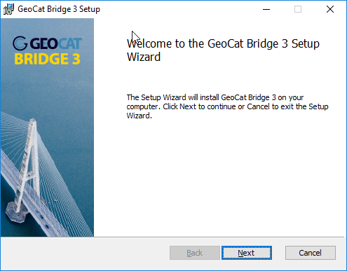
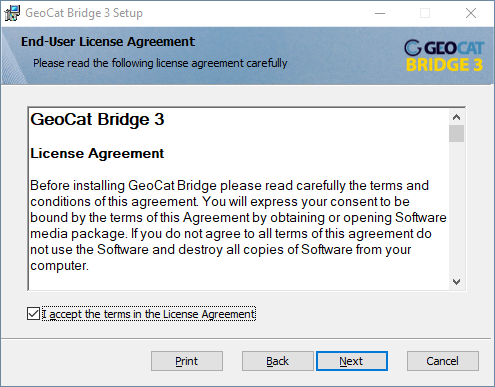
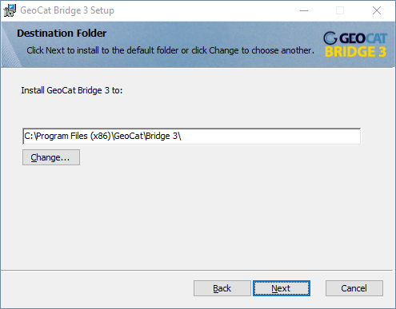
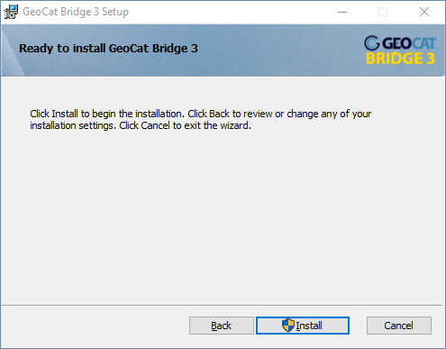
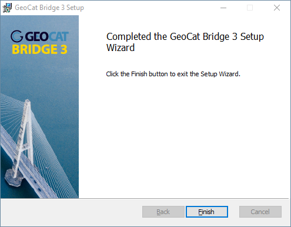
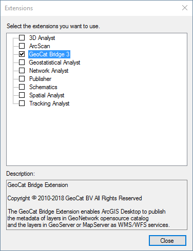
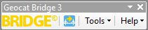

# Installation

* [Installation for QGIS](#installation-for-qgis)
* [Installation for ArcMAP](#installation-for-arcmap)
* [Installation for ArcGIS Pro](#installation-for-arcgis-pro)

## Installation for QGIS

The plugin is registered on the QGIS plugin repository as 'experimental'.
In settings of the plugin repository, enable experimental plugins. Then look for a plugin 'GeoCatBridge', install and enable it. Look for the plugin icon on the toolbar or in the 'web' menu.

 

Bridge plugin requires [lxml](https://lxml.de/) helper to be available on the system. The module is made available via the plugin for windows. On Linux and MacOS install the helper using [pip](https://pypi.org/project/pip/).

```
pip install lxml
```

## Installation for ArcMAP

Execute the file `SetupExtension.msi` to
start the installation of Bridge





Click `Next` to accept the license.



Select the folder to install Bridge and click `Next`



Click `Install` to confirm the installation.



The installation proceeds and informs you when it is finished.

### Activation

After the successful installation of GeoCat Bridge start ESRI ArcMap to
start using Bridge.

Check under `Customize` \> `Extensions` that the extension is installed
and enabled:



### Bridge toolbar


To show the Bridge toolbar, click on the ArcMap® toolbar with your right
mouse button and select *GeoCat Bridge* from the list.



## Installation for ArcGIS Pro

A installer for ArcGIS Pro is not available yet.
