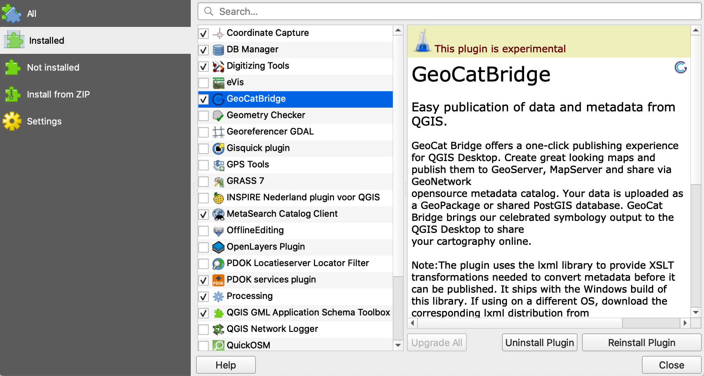

Installation
#############

The plugin is registered on the QGIS plugin repository as 'experimental'.

In settings of the plugin repository, enable experimental plugins. Then look for a plugin 'GeoCatBridge', install and enable it. Look for the plugin icon on the toolbar or in the 'web' menu.



Bridge plugin requires the `lxml <https://lxml.de/>`_ library. The Windows version of the library is shipped with the plugin package. On Linux and MacOS, you must install it using `pip <https://pypi.org/project/pip/>`_.

```
pip install lxml
```
