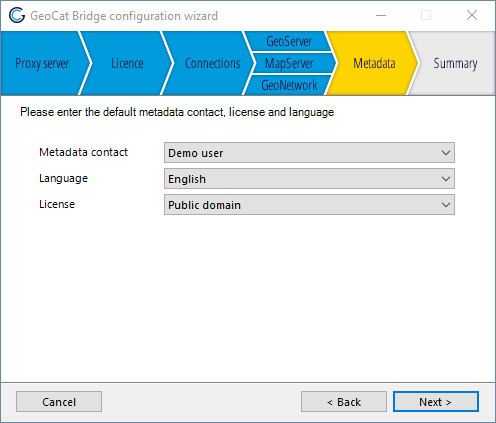

# Configuration

## Proxy to access the internet

Bridge needs internet access, this section may be relevant if your
organisation requires users to use a proxy to access the internet, and
the system proxy settings are not usable by Bridge. 

In Arcmap configure the proxy server in the bridge settings.

In QGIS the proxy settings are available under generic QGIS settings.

## Server connections

Here you can add or edit your GIS server connections, click on the
*Open* button to go the server connection screen, see [Server Connections](7_server_configuration).

## Metadata configuration

Here you can enter the default metadata contact, license and language.
When a layer does not have any metadata defined Bridge will use these
values while publishing to the map and catalog servers.

