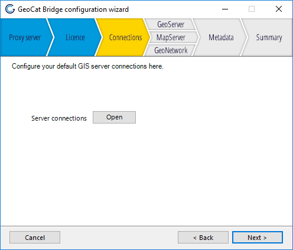
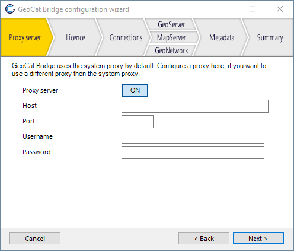
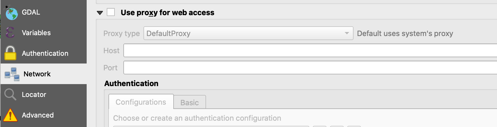

# Configuration

In order to use bridge you need to set up a series of server connections. Some other configuration options are available to set sensible defaults. For advanced users there is also a configureation file in the installation folder to set advanced options, check the configuration file itself for additional documentation.

Settings are available in the ArcMAP configuration wizard, the ArcMAP bridge toolbar or the second tab in the QGIS publish window.

## Server connections

Here you can add or edit your GIS server connections, click on the
*Open* button to go the server connection screen, see [Server Connections](7_server_configuration).

## Proxy to access the internet

Bridge needs internet access, this section may be relevant if your
organisation requires users to use a proxy to access the internet, and
the system proxy settings are not usable by Bridge. 

In Arcmap configure the proxy server in the bridge settings.

In QGIS the proxy settings are available under generic QGIS settings.

