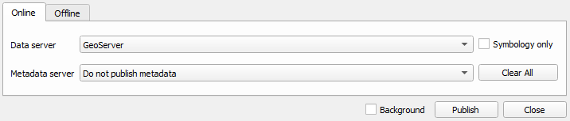

# Publish data

## Supported Layers

GeoCat Bridge supports the following layer types:

-   Vector layers from any source
-   Raster layers from any source
-   Layer groups

## How to publish

Click on the Publish wizard icon  on the
Bridge toolbar to open the *Publish Wizard* dialog.

### Publish Wizard dialog

The *Publish Wizard* shows all the publishable layers in your project.

You can select the layers from the list to publish:

An icon  is shown next to the layer name
if the layer\'s metadata and/or map data is published in the currently
selected server(s).

### Edit metadata and select attributes

In the *Layer panel* the user can for each layer:

-   Edit the metadata (see
    [Metadata Editing](8_metadata_editing))
-   Select the attributes to publish as part of the map service.
    Attributes can only be selected for vector data.

### Publishing

When you finished configuring the properties for all map layers, click
on the *Publish* button to start the publishing process. During this
process, a progress bar is shown to indicate the status of the
publication proces:

When the publication process is finished, a summary of the result is
shown:

## View published layers on server(s)

The context menu in the layers list provides a quick access to view the
published data on the server(s):

-   *View metadata*: If the metadata is already published in a catalogue
    server, this option opens a browser to show the metadata from the
    server.

-   *View WMS layer*: Opens up a layer preview page for the selected map
    server with the selected layer.
-   *View all WMS layers*: Opens up a layer preview page for the
    selected map server with all published layer in the map project
    (MXD).

When a data or metadata server is selected and there are issues connecting to it, the server
box appears framed in a red box.

Unpublish data and metadata
---------------------------

### Remove data and metadata all layers

 removes both the metadata and map data of all
selected layers from the publishing server(s).

::: tip Note

When removing data from GeoServer, Bridge does not remove the spatial
data files, such as Shapefile, GeoPackage and GeoTIFF. GeoServer does
not allow to remove these files through the REST API. When publishing to
GeoServer with PostGIS, Bridge will not remove the data tables from
PostGIS.
:::

### Remove data and metadata individual layers

If you want to withdraw only metadata or map data for a specific layer,
use the context menu in the layers list.

-   *Unpublish metadata*: remove the metadata from the selected
    catalogue server.
-   *Unpublish data*: remove the map data from the selected map server.

### Export files

To export your files locally, use the offline export options in Bridge.
The offline export makes it possible to export the metadata and
symbology in the following formats:

-   SLD (symbology)
-   Geostyler (symbology)
-   MapboxGL (symbology)
-   ISO19319-XML (metadata)

Select a folder and the corresponding files will be created in it for
all the layers currently selected.

