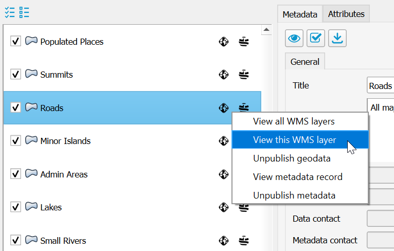
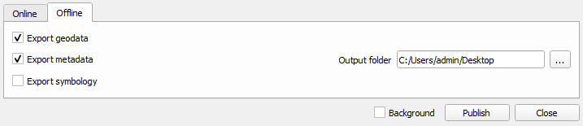

# Publish data

## Supported Layers

GeoCat Bridge supports the following layer types:

-   Vector, featureclass from any source
-   Raster, raster from any source
-   Annotation layers
-   Layer groups (in workspace mode)

## How to publish

Click on the Publish wizard icon  on the
Bridge toolbar to open the *Publish Wizard* dialog.

::: tip Note

Before clicking on the Wizard button, please make sure that the map view
contains supported feature layers and/or supported image layers. If
there are no layers to be published, a warning dialog is shown:

:::

### Publish Wizard dialog

The *Publish Wizard* shows all the publishable layers in your project.

You can select the layers from the list to publish:

An icon  is shown in the corresponding column
if the layer\'s metadata and/or map data is published in the currently
selected server(s).

### Edit metadata and select attributes

In the *Layer panel* the user can for each layer:

-   Edit the metadata (see
    [Metadata Editing](8_metadata_editing))
-   Select the attributes to publish as part of the map service.
    Attributes can only be selected for vector data.

An information icon  is shown in the first column if
the metadata is incomplete. In this case the metadata can still be
published, but is not valid according to the selected metadata profile.
Hold the mouse on the cell of the Publish column for more information
about the empty or invalid fields. In the image below, the
`Abstract` field of layer
`sites` is empty.

### MapServer featureinfo template

When publishing to a MapServer server the tab *Mapfile options* will be
visible in the *Layer panel*. Here you can configure for each layer if
the WMS layer will support the *getfeatureinfo* request.
Note, at the moment this feature is only available for MapServer.

Getfeatureinfo is enabled by default, when it is enabled Bridge will
generate a getfeatureinfo template that includes all the attributes that
have been selected to be published under *Data* tab of the *Layer
panel*.

#### Customize default template

The default template can be customized by the user by editing the
following files:

-   `[BRIDGE INSTALLATION DIRECTORY]\templates\style.css`
-   `[BRIDGE INSTALLATION DIRECTORY]\templates\footer.html`

The `style.css` will be included as stylesheet in the default template.
The `footer.html` file will be included below the table element
containing the attribute information.

### Publishing

When you finished configuring the properties for all map layers, click
on the *Publish* button to start the publishing process. During this
process, a progress bar is shown to indicate the status of the
publication proces:

When the publication proces is finished, a summary of the result is
shown:

## View published layers on server(s)

The context menu in the layers list provides a quick access to view the
published data on the server(s):

-   *View metadata*: If the metadata is already published in a catalogue
    server, this option opens a browser to show the metadata from the
    server.

-   *View WMS layer*: Opens up a layer preview page for the selected map
    server with the selected layer.
-   *View all WMS layers*: Opens up a layer preview page for the
    selected map server with all published layer in the map project
    (MXD).

The icon  is shown when a error occurs
while connecting to the server. Hover over the icon with the mouse
pointer to view the error message.

Unpublish data and metadata
---------------------------

### Remove data and metadata all layers

 removes both the metadata and map data of all
selected layers from the publishing server(s).

::: tip Note

When removing data from GeoServer, Bridge does not remove the spatial
data files, such as Shapefile, GeoPackage and GeoTIFF. GeoServer does
not allow to remove these files through the REST API. When publishing to
GeoServer with PostGIS, Bridge will not remove the data tables from
PostGIS.
:::

### Remove data and metadata individual layers

If you want to withdraw only metadata or map data for a specific layer,
use the context menu in the layers list.

-   *Unpublish metadata*: remove the metadata from the selected
    catalogue server.
-   *Unpublish data*: remove the map data from the selected map server.

### Export files

To export your files locally, use the offline export options in Bridge.
The offline export makes it possible to export the metadata, data an
symbology in the following formats:

-   GeoPacakage (data)
-   Shapefile (data)
-   SLD (symbology)
-   ISO19319-XML (metadata)

MapServer offline export is not included. To offline export MapFiles for
MapServer configure MapServer to export to a local path, see
[MapServer connection](7_server_configuration.html#mapserver-connection).

By default, the files are created in the
`My Documents` folder. To select another
destination, click button .

### GeoPackage

Exports each layer in seperate GeoPackage file.

### Shapefile

Exports each layer in seperate Shapefile file.

### SLD

Exports each layer in seperate SLD file. Currently supported SLD
versions are:

-   SLD version 1.0.0
-   SLD version 1.0.0 with GeoServer vendor extensions

For cases where the symbology is dependent on a attribute value, you can
configure the SLD export to truncate the attribute names to 10
characters, in case you plan to use the SLD with a Shapefile
datasource.

### ISO19319-XML

Exports metadata of each layer in seperate ISO19139-XML metadata
documents. Select profile:

-   Default: ISO19139
-   Dutch version 1.3.1
-   Inspire

