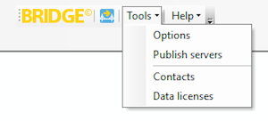
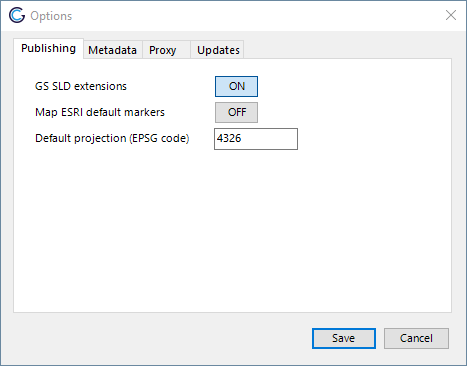
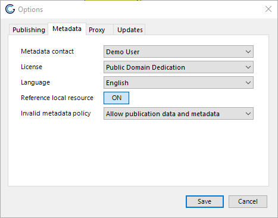
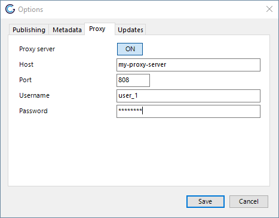
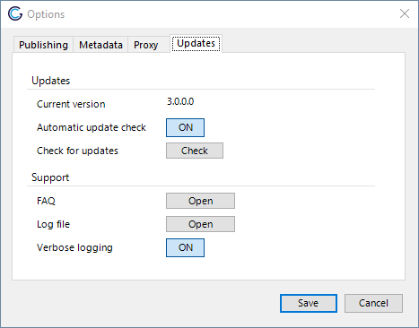
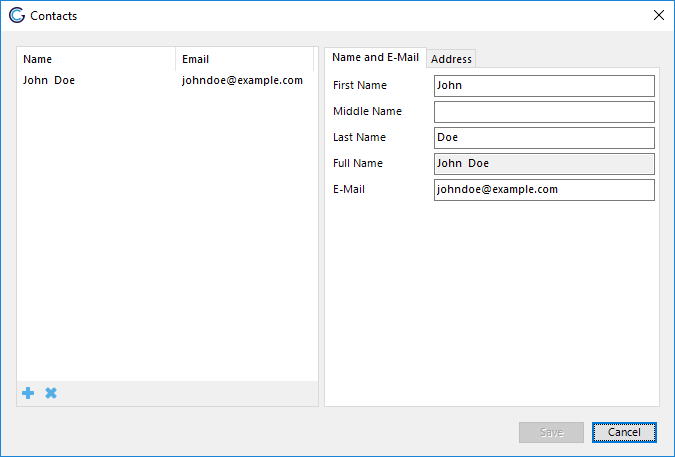
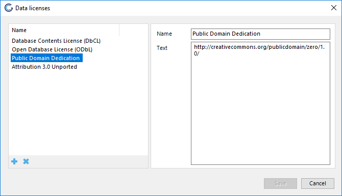
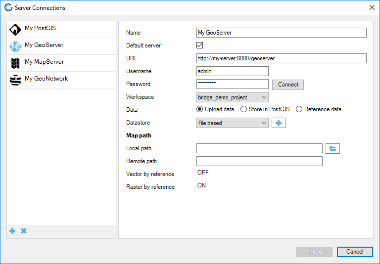

# Configuration of bridge

## Tools

These configuration options are currently only available for ArcMAP.

Clicking the *Tools* button in Bridge will reveal all the configuration
menus available in Bridge:

-   [Options](#options): shows Bridge options.
-   [Contacts](#contacts): to manage contacts.
-   [Data Licenses](#data-licenses): to manage data
    licenses.



## Options

### Publishing



#### GeoServer SLD Extensions

By default the SLD created is optimized to use GeoServer SLD extensions.
If you want to use the SLD in an application where these extensions are
not supported, uncheck this option.

#### Map Esri® default markers

By default a subset of symbols from the Esri® Default Marker font are
mapped to symbols in Webdings, Wingdings and Wingdings2 since Esri®
fonts are not standard available in the server where the layers are
published. If you want to use the original font
symbols, uncheck this option. The font used in the symbology needs to be
installed on the server, otherwise this could result in rendering issues
of the published layers. The font mapping is only applied to styles
published in GeoServer.

#### Default projection

When publishing a layer without projection information, the default
coordinate reference system is used.

### Metadata



#### Default values

Set the default contact, license and language for metadata. The default
values will be used when Bridge publishes layers that have no values
defined for these metadata fields.

#### Publish references to local resources

Select this checkbox to publish the local resource references in the
metadata to the catalogue server.

#### Invalid metadata policy

Rule to determine what happens when the metadata is not valid according
to the selected metadata schema and schematron in the selected server
connection in the catalogue server dropdown. When no catalogue server is
selected Bridge uses the default metadata profile (ISO19115/ISO19139).

Options:

1.  Allow publication data and metadata
2.  Deny publication metadata
3.  Deny publication data and metadata

When publishing from the ArcMap user interface, Bridge will skip the
layers with invalid metadata only, if the \"Invalid metadata policy\" is
set to deny. Layers with valid metadata in the MXD will be published.

When publishing from the CLI Bridge will skip publication of all layers
when a layer is found with invalid metadata, is the \"Invalid metadata
policy\" is set to deny.

### Proxy



Configure a proxy server if you want to use a proxy server that is
different from the system proxy server.

### Updates



#### Updates

##### Check for updates

Click the button *Check* to check if there is a new version available.
See [Application Update](9_application_update).

##### Automatic update check

By default enabled, disable to turn off automatic update checks.

#### Support

##### Log file

Open the GeoCat Bridge log file in your default text editor.

##### Verbose logging

Enabled by default. When this setting is enabled more detailed messages
will be logged in the logfile. Enable this option if you experience
errors in Bridge. You will need to restart ArcMap to apply the changes.

## Contacts

Manage metadata contacts. These contacts are saved in the Bridge
configuration file database. Contacts are used in the dataset metadata
and service metadata. Think of the metadata and data contact in a
metadata record on a dataset. When Bridge encounters a unknown contact
in a metadata record, the new contact is added to the Bridge list of
contacts



## Data licenses

Manage data license. Data licenses are used in dataset metadata to
indicate under what conditions the dataset can be used. By default a
number of open data licenses have been added to Bridge.

::: tip Note

Please ensure that you add your own data licenses through this panel.
GeoCat does not take any responsibility or liability for erroneous use
of data licenses.
:::



Configuration file
------------------

Bridge uses an XML configuration to configure options that are
configurable through the user-interface. The configuration file is
located in the LocalApplicationData directory of each user:
`C:\Users\<USER>\AppData\Local\GeoCat\Bridge 3\bridge.config`. Removing
the `bridge.config` file from the LocalApplicationData directory will
return the configuration to the default settings.

### AddDownloadLinksMetadata 

When a value is specified Bridge will add the a download link with the
format of the value to the metadata. Bridge checks if the download link
with that format is available on the server. Setting only works for
publishing to GeoServer.

|  Key         | GeoServer format |
|  ------------| -------------------------------------- |
|  CSV         | csv |
|  GML2        | text/xml; subtype=gml/2.1.2 |
|  GML3.1      | gml3 |
|  GML3.2      | application/gml+xml; version=3.2 |
|  GeoJSON     | json |
|  KML         | application/vnd.google-earth.kml+xml |
|  Shapefile   | SHAPE-ZIP |
|  geopackage  | geopackage |
|  geotiff     | image/tiff |
|  FileGDB     | ESRI-FileGDB |

Allowed values:

-   Comma separated list of formats, allowed values in list: `CSV`,
    `GML2`, `GML3.1`, `GML3.2`, `GeoJSON`, `KML`, `Shapefile`,
    `geopackage`, `FileGDB`

Default value:

``` xml
<add key="AddDownloadLinksMetadata" value=""/>
```

### BasicAuthenticationGeoServer

Set Bridge to use basic authentication to connect to GeoServer. By
default Bridge uses form authentication with a `JSESSIONID` cookie.

Allowed values:

-   True
-   False

Default value:

``` xml
<add key="BasicAuthenticationGeoServer" value="False"/>
```

### CopyFontsMapServer

Copy fonts of symbology to MapServer on publication. Be aware that you
need to have a valid license to use some proprietary fonts on your
MapServer. For instance it is not allowed to use ESRI fonts on a server
that is not running any licensed ESRI products.

When using an ftp service to copy the fonts to your server you will need
to either:

-   create an alias named `_bridge_fonts_` in the home folder of the ftp
    user that points to the MapServer fonts folder (FileZilla Server on
    Windows)
-   create a directory named `_bridge_fonts_` in the home folder of the
    ftp user and mount the MapServer fonts folder on it like this:

Creating a directory named `_bridge_fonts_` is not required when copying
the files to the local filesystem.

``` bash
mkdir /mapserver/projects/_bridge_fonts_
mount --bind /mapserver/fonts /mapserver/projects/_bridge_fonts_
```

When copying of the files fails, no error message is displayed in the
publish report afterwards, this will be improved in a later version.
Check the log file for error messages on copying the fonts.

Allowed values:

-   True
-   False

Default value:

``` xml
<add key="CopyFontsMapServer" value="False"/>    
```

### CustomDownloadProtocols

Set specific protocol string for format specific download links in the
metadata, see [Add download links](#configuration-file). Comma
separated list of key value pair. Key and value should be separated by
%. The key GML sets the download format for all GML formats
(GML2,GML3.1,GML3.2). Data format needs to be supported by GeoServer in
order for Bridge to create download link in the metadata.

Allowed keys: `CSV`, `GML`, `GML2`, `GML3.1`, `GML3.2`, `GeoJSON`,
`KML`, `Shapefile`, `geopackage`, `geotiff`, `FileGDB`.

Example usage:

``` xml
<add key="CustomDownloadProtocols" value="GeoJSON%JSON,KML%OGC:KML"/>
```

Default value:

``` xml
<add key="CustomDownloadProtocols" value=""/>       
```

### DisableUpdater

Disable automatic checking for updates

Allowed values:

-   True
-   False

Default value:

``` xml
<add key="DisableUpdater" value="False"/>
```

### Expect100Continue

Adds HTTP header `Expect: 100-Continue` to all HTTP requests

Allowed values:

-   True
-   False

Default value:

``` xml
<add key="Expect100Continue" value="True"/>
```

### FileRasterByReference

Publish raster data by reference to GeoServer. Prevents uploading raster
files to GeoServer, requires the raster files to be accessible from both
ArcMap and GeoServer. When this option is enabled and additional
configuration option \"Map path\" is shown in the GeoServer
configuration panel. Supported file formats are GeoTiff,WorldImage, ECW
and ImageMosaic.



The map path option allows to configure a mapping between from the local
path to the remote path. For instance when the raster data is available
for ArcMap in `D:\rasters` and for GeoServer in `Z:\rasters` the value
for local path is `D:\` and the value for remote path is `Z:\`.

Allowed values:

-   True
-   False

Default value:

``` xml
<add key="FileRasterByReference" value="False"/>
```

### FileVectorByReference

Publish shapefiles by reference to GeoServer. Prevents uploading vector
files to GeoServer, requires the shapefiles to be accessible from both
ArcMap and GeoServer. When this option is enabled and additional
configuration option \"Map path\" is shown in the GeoServer
configuration panel. See the FileRasterByReference option for a
screenshot. Shapefile only, so does not work for any geodatabase (FGDB,
PGDB, etc.)

The map path option allows to configure a mapping between from the local
path to the remote path. For instance when the vector data is available
for ArcMap in `D:\vectors` and for GeoServer in `Z:\vectors` the value
for local path is `D:\` and the value for remote path is `Z:\`.

Allowed values:

-   True
-   False

Default value:

``` xml
<add key="FileVectorByReference" value="False"/>
```

### ForceShapefile

Use Shapefile format even if the GeoPackage extension is installed in
GeoServer.

Allowed values:

-   True
-   False

Default value:

``` xml
<add key="ForceShapefile" value="False"/>   
```

### GeonetworkEcasAuthentication

Enable the option for ECAS authentication for GeoNetwork server
connections.

Allowed values:

-   True
-   False

Default value:

``` xml
<add key="GeonetworkEcasAuthentication" value="False"/> 
```

### HTTPUserAgent

Sets a user-agent string for all HTTP requests. Default value is an
empty string. In case you need to specify a user-agent a recommended
value is `geocat-bridge`.

Allowed values:

-   Any string made out of the following character set \[a-zA-Z0-9\]

Default value:

``` xml
<add key="HTTPUserAgent" value=""/> 
```

### KeepExistingDistOnPublication

On publication of metadata to catalogue keep all online resources
referenced in the metadata. When set to False Bridge will remove all the
online resources referenced in the metadata and only add the online
resources for the current publication.

Allowed values:

-   True
-   False

Default value:

``` xml
<add key="KeepExistingDistOnPublication" value="False"/>
```

### LayerGroupMode

Default mode for layer groups created in GeoServer, valid values are
`CONTAINER`, `SINGLE` and `NAMED`.

Allowed values:

-   CONTAINER
-   SINGLE
-   NAMED

Default value:

``` xml
<add key="LayerGroupMode" value="CONTAINER"/>
```

### LowerCasePostGIS

When set to true Bridge will create lower case tables in PostGIS with
lowercase column names and create layers with lowercase layernames in
OWS services in GeoServer. Recommended to set to True, default value is
set to False for backwards compatibility.

Allowed values:

-   True
-   False

Default value:

``` xml
<add key="LowerCasePostGIS" value="False"/>
```

### MapfileMAXSIZE

Set `MAXSIZE` for MapServer mapfile, when set to 0 Bridge will not
specify `MAXSIZE`. In that case MapServer uses the default as `MAXSIZE`
(2048px).

Allowed values:

-   Any positive integer value

Default value:

``` xml
<add key="MapfileMAXSIZE" value="2048"/>
```

### MarginExtent

Sets a margin on the bounding box of the Mapfile or the bounding box of
the layer (GeoServer). Value is a percentage of the layer or map extent.

Allowed values:

-   Any positive decimal value

Default value:

``` xml
<add key="MarginExtent" value="0.05"/>
```

### MetadataTitleAsOWSTitle

Use the metadata title of the layer in GeoServer/MapServer as layer
title, instead of using the TOC layername

Allowed values:

-   True
-   False

Default value:

``` xml
<add key="MetadataTitleAsOWSTitle" value="False"/> 
```

### OwsAccessConstraints

Set default value for access constraints in OWS capabilities document
(GeoServer only), when empty Bridge will not configure this value for
new workspaces and therefore the value from
`/rest/services/wms/settings.xml` will configure this value.

Allowed values:

-   Any string

Default value:

``` xml
<add key="OwsAccessConstraints" value=""/>
```

### OwsFees

Set default value for fees in OWS capabilities document (GeoServer
only), when empty Bridge will not configure this value for new
workspaces and therefore the value from
`/rest/services/wms/settings.xml` will configure this value.

Allowed values:

-   Any string

Default value:

``` xml
<add key="OwsFees" value=""/>
```

### ReverseWMSLayers

Reverse layers in WMS service workspace/mapfile. By default Bridge
organises the layers in the WMS based on drawing order. So the top layer
(in your ArcMap map project) will be the last layer in the WMS
capabilities document. If you want the top layer (in your ArcMap map
project) to be the first layer in the WMS capabilities document, set the
`ReverseWMSLayers` configuration option to `True`.

Allowed values:

-   True
-   False

``` xml
<add key="ReverseWMSLayers" value="False"/>
```

### SymbolSizeFactor

Multiply symbol size for MapServer mapfile with this factor

Allowed values:

-   Any decimal value (decimal separator \".\")

Default value:

``` xml
<add key="SymbolSizeFactor" value="1.0"/> 
```

### TimeOutCapabilitiesRequest

Set timeout for capabilities requests to OGC Web Services. Value is
timeout in milliseconds, default value of 15000 is equal to 15 seconds.

Allowed values:

-   Any valid 32-bit signed integer value bigger or equal to zero

Default value:

``` xml
<add key="TimeOutCapabilitiesRequest" value="15000"/>
```

Administrator configuration
---------------------------

The configuration and the server connections of Bridge are saved in a
SQLite database in the local application data folder called
`bridge_config.db`. The local application data folder can be found under
(substitute the `<USER>` with the actual user name):
`C:\Users\<USER>\AppData\Local\GeoCat\Bridge 3`.

This file can be used as a configuration file for deploying Bridge on a
large number of machines. Simply configure Bridge on one machine and
retrieve `bridge_config.db` and use this file to configure other
installations.

A template configuration database can be found in the Bridge
installation folder. The Bridge installation folder is typically located
in `C:\Program Files\GeoCat\Bridge 3` (32 bits OS) or
`C:\Program Files (x86)\GeoCat\Bridge 3` (64 bits OS). The empty
database can be used to reset the existing configuration, by replacing
the file in the local application data folder with the one from the
installation folder.

### Administrator configuration bridge.config

As a administrator one can configure the default values in the
`bridge.config` file for all users. Do this by creating a copy of the
`bridge.config.template` file in the installation directory and naming
the copy `bridge.config`.

When the `bridge.config` file is present in the installation directory,
Bridge will copy this configuration file to the Bridge
LocalApplicationData directory on first startup.

### Password Encryption

Note that the passwords for all the server configurations are encrypted
inside the GeoCat Bridge configuration database.

