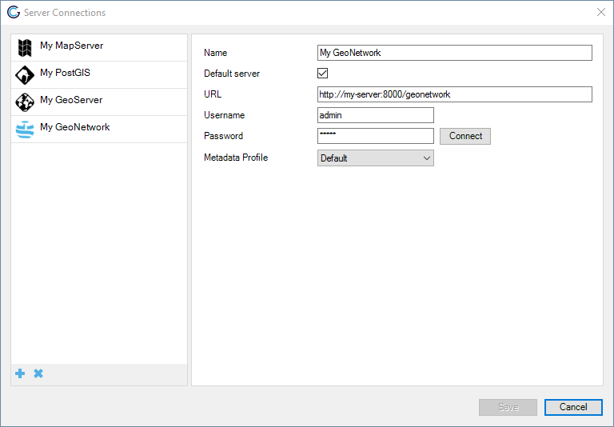
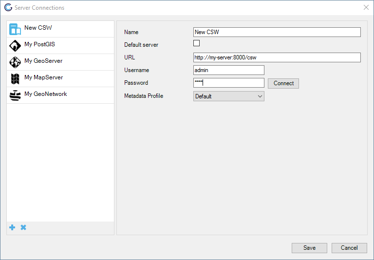
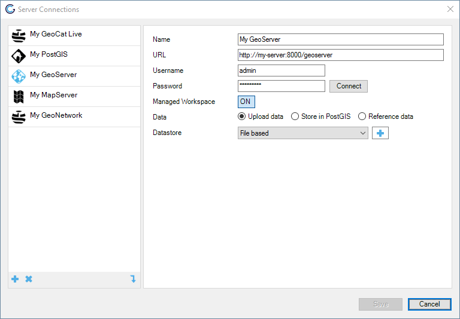
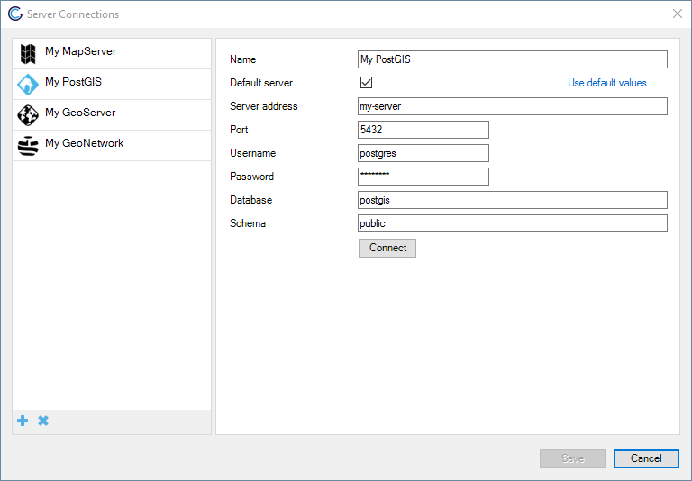
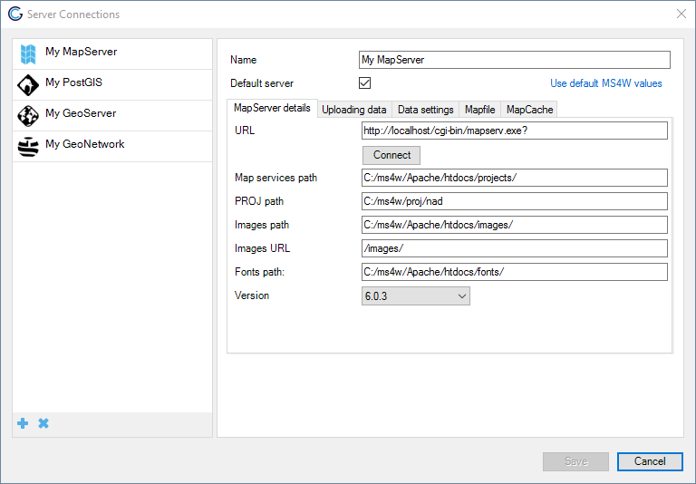
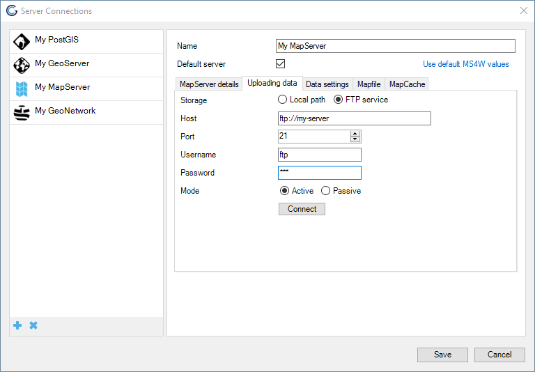
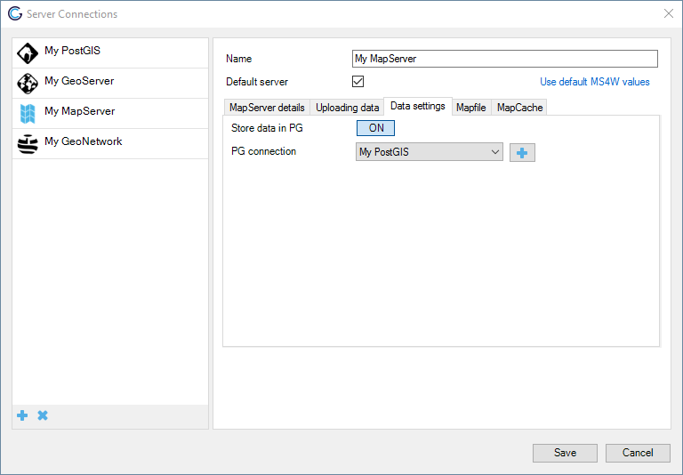
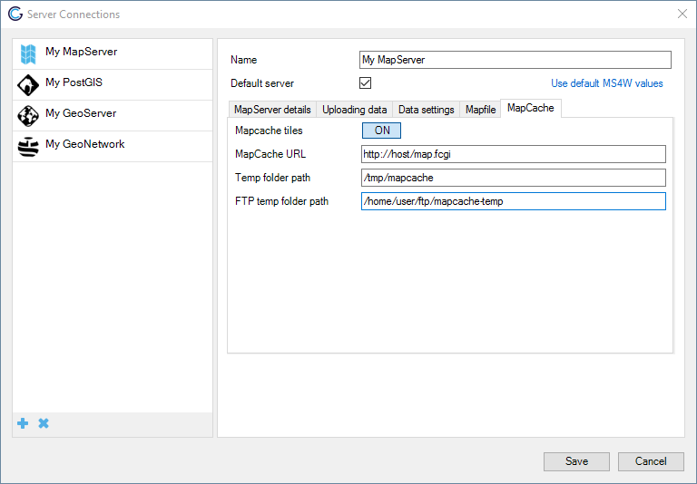
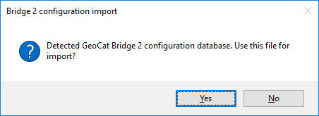

Server Connections
==================

Configure your server connections to publish your data and metadata to.

Check the [Server Requirements](2_background_and_requirements)} to check
what versions of the different connection types are compatible with
GeoCat Bridge.

Add new connection
------------------

Click *New*  and choose one of the supported
server connection types to create a new server:

-   GeoCat Live
-   GeoServer
-   MapServer
-   PostGIS
-   GeoNetwork
-   CSW


GeoCat Bridge can also import server connections from Bridge 2, click
 to open the import server connections form,
see [Import Server Connections](#import-server-connections).

GeoCat Live
-----------

GeoCat Live is a SDI platform hosted by GeoCat. Depending on your GeoCat
Live configuration Bridge is able to publish metadata to a catalogue
server (CSW) and the layers of the map to a mapserver
(WMS/WFS/WCS/WMTS). Components used


To configure a GeoCat Live connection first fill in the instance
identifier and then click connect. This will retrieve the available
server connections for the GeoCat Live instance you are connecting to.
GeoCat Live connection in the figure above has a GeoServer and
GeoNetwork connection available. For both the credentials need to be
supplied. When publishing Bridge will publish automatically to all
available server connections of your Live instance.

| Name                          | Name of the server connection                       |
| ----------------------------- | --------------------------------------------------- |
| Instance identifier           | Identifier that uniquely identifies the instance    |
| GeoServer username/password   | Credentials of a user with privileges to publish    |
| GeoNetwork username/password  | Credentials of a user with privileges to publish    |

## GeoNetwork or generic CSW connection


Configure a GeoNetwork or generic CSW connection to publish your
metadata to an online catalogue. If the catalog is GeoNetwork then
preferably use a GeoNetwork connection. Using the GeoNetwork connection
allows to publish also a thumbnail for the dataset.

A CSW server should support CSW-transactions to be able to publish to it
with Bridge.





| Label              | Content  |
| ------------------ | --------------------------------------- |
| Name               | Name of the server connection |
| Url                | Base url of the catalog server |
| Username/password  | Credentials of a user with privileges to publish |
| Default server     | Set as default server |
| Metadata profile   | Choose the metadata profile |

Click *Connect* to test the server connection.


GeoServer connection
--------------------

Configure a GeoServer connection to publish your data to GeoServer.



Fill the form fields.


| Name | Name of the server connections                |                            |
| ---- | --------------------------------------------- |--------------------------- |
| Default | Set as default server           |                            |
| Url  | Base url of the GeoServer server      |                            |
| Username/password | Credentials of a user with privileges to publish     |                            |
| Managed workspace | Each ArcMap project (.mxd) represents 1 geoserver workspace     |                            |
| Workspace | If not `managed workspace`, layers from various projects are published to this workspace |                            |
| Data store | Select the datastore to store data in                         |                            |
| *Data management* |                                 |                            |
|      | Upload data                     | Upload data to GeoServer using Shapefile or GeoPackage and GeoTIFF.    |
|      | Store in PostGIS                | Store data in PostGIS through direct connection with PostGIS database. This option requires the database to be accessible locally (by ArcMAP).       |
|      | Reference data                  | Publish data in GeoServer by referencing existing data from a database.      |

<!-- 
+\-\-\-\-\-\-\-\-\-\-\-\-\-\-\-\-\-\--+\-\-\-\-\-\-\-\-\-\-\-\-\-\-\-\-\-\-\-\-\-\-\-\-\-\-\-\-\-\-\-\-\-\-\-\-\-\-\-\-\-\-\-\-\-\-\-\-\-\-\-\-\-\-\-\-\-\-\-\-\-\-\-\-\-\-\-\-\-\-\-\-\-\-\-\-\-\-\-\-\-\-\-\-\-\-\-\-\--+\-\-\-\-\-\-\-\-\-\-\-\-\-\-\-\-\-\-\-\-\-\-\-\-\-\-\-\-\-\-\-\-\-\-\-\-\-\-\-\-\-\-\-\-\-\-\-\-\-\-\-\-\-\-\-\-\-\-\-\-\-\-\-\-\-\-\-\-\-\-\-\-\-\-\--+

With the option `Upload data` there is an additional option to select a
File based storage or Database storage. To enable storage in a database
select an existing GeoServer Datastore or create a new Datastore by
clicking \"+\". The database connection details are relative to the
remote GeoServer. There is no need to expose the database locally. The
database user should have `create` and `write` privileges on the
database.

When using `Reference data`, Bridge currently only supports Oracle
databases. Make sure to use MDSYS.SDO\_GEOMETRY in stead of
SDE.ST\_GEOMETRY to store geometries in Oracle and the data is spatially
indexed. Oracle layers can be exposed to ArcMAP via ArcSDE. -->

### Managed Workspace

When this option is turned on, Bridge will manage about the workspaces
in GeoServer by enforcing a one to one relationship between ESRI map
projects (.mxd) and workspaces. When publishing a `mapdocument_a.mxd`
with layer `layer_a` and `layer_b`, bridge will create a new workspace
`mapdocument_a` in GeoServer and publish both layers in this workspace.
Workspace mode is required if you want to publish layers in a hierarchy
similar to the ArcMAP Table of Contents. Note that layers will be
removed from GeoServer if they don\'t exist in the local mxd anymore.
When this option is turned off you have to select a workspace in which
published layers will be published as part of the server configuration,
no layers are removed automatically.

PostGIS connection
------------------

Configure a PostGIS connection to publish your map data to PostGIS. The
PostGIS connection can be used in three different publish scenarios:

1.  Publish only map data to PostGIS
2.  Publish map layers to GeoServer and store data directly in PostGIS
    using a direct database connection
3.  Publish map layers to MapServer and store data directly in PostGIS
    using a direct database connection



MapServer connection
--------------------

MapServer uses `Managed Workspaces` mode by default. A mapserver
endpoint (mapfile) is created for each local ArcMAP project.

Configure a MapServer connection to publish your maps from ArcGIS
Desktop® to MapServer. When using [Mapserver 4
Windows](http://www.ms4w.org) choose *Use default MS4W values* to fill
out the MapServer details form.



In the *Uploading data* tab configure how Bridge stores data for your
MapServer connection. Choose *Local path* to store the files in a
location on the local file system. Choose *FTP service* to transmit the
files over FTP to the MapServer server.



Bridge currently does not offer functionality to deactivate managed
workspace for Mapserver. This means that each ArcMap project is
published as a single service endpoint (mapfile).

## MapServer data connection

In the *Data settings* tab enable *Store data in PG* to have Bridge
store vector data in a PostGIS database. When enabled you can choose a
connection from the available PostGIS connections. To create a new
PostGIS connection see [PostGIS connection](7_server_configuration.html#postgis-connection).



### Copy fonts to MapServer

Bridge can be configured to copy the fonts used in your symbology to
MapServer. See [CopyFontsMapServer](6_configuration_extension.html#CopyFontsMapServer) for
more details.

#### MapCache configuration

With the MapCache module of GeoCat Bridge you can configure a MapCache
instance to serve map tiles. The MapCache module does not manage the
seeding of map tiles.

### MapCache requirements

With the MapCache module Bridge can configure one Mapcache instance per
MapServer. This means that all the mapfiles will share one endpoint for
the tile cache. To have Mapcache reload the configuration after each
change to the configuration file it is required to have MapCache
installed with FastCGI.

Installation instructions for MapCache with FastCGI on Ubuntu 14.04:

For MapCache to auto refresh the configuration MapCache with FastCGI is
a prerequisite. To install Mapcache with FastCGI you need to install the
following packages:

-   mapcache-cgi (version 1.2.1-2)
-   libapache2-mod-fcgid (version 1:2.3.9-1)

Install with:

``` bash
sudo apt-get install mapcache-cgi libapache2-mod-fcgi
```

Enable the FastCGI apache module with:

``` bash
sudo a2enmod fcgid
```

Add the following snippet to the Apache virtual host (located on Ubuntu
on `/etc/apache2/sites-enabled/000-default.conf`) to enable the MapCache
service:

``` 
<IfModule mod_fcgid.c>
FcgidIOTimeout 120
FcgidInitialEnv "MAPCACHE_CONFIG_FILE" "/home/user/ftp/projects/mapcache.xml" 
<Location /map.fcgi>
Order Allow,Deny
Allow from all
SetHandler fcgid-script
</Location>
ScriptAlias /map.fcgi "/usr/lib/cgi-bin/mapcache"  
</IfModule>
```

Restart the Apache service:

``` bash
sudo apachectl restart
```

Check whether MapCache is running correctly by visiting the following
url in your browser (assuming that the Mapcache configuration file has
the demo service enabled): <http://localhost/map.fcgi/demo>

### FTP setup

When republishing a Mapcache for a layer Bridge will delete the cached
tiles from the temp folder path for that layer by FTP. This means that
the temp folder needs to be accessible and writable by the FTP user.
Therefore the Mapcache FTP configuration consists of two fields:

-   Path to tmp folder \--\> Absolute path to tmp folder on server
-   FTP path to tmp folder \--\> Path to tmp folder that is accessible
    for ftp user

In the scenario that FTP user is not allowed to venture outside of its
home folder it is advised to mount the Mapcache temp folder in the FTP
users home directory like this:

``` bash
mkdir /home/user/ftp/mapcache-temp
mount --bind /tmp/mapcache/ /home/user/ftp/mapcache-temp
```

For the configuration of the Mapcache this means the following values:

-   Path to tmp folder \--\> `/tmp/mapcache`
-   FTP path to tmp folder \--\> `/mapcache-temp`

In the scenario that the FTP user has direct access to the Mapcache temp
folder the same values can be supplied:

-   Path to tmp folder \--\> `/tmp/mapcache`
-   FTP path to tmp folder \--\> `/tmp/mapcache`

### File permissions

MapCache needs sufficient permissions to write the tiles to the
temporary folder. Therefore the temporary MapCache folder should be
owned by the www-data user and www-data group.

``` bash
sudo chown www-data:www-data /tmp/mapcache
```

The FTP user also needs permissions to delete tiles from the temporary
folder. SO the FTP users needs to be added to the www-data group and the
File Acces Control list for the MapCache folder needs to be modified, so
all files created in the MapCache temp folder are writable by group
members.

``` bash
usermod -g www-data user 
sudo chmod g+s /tmp/mapcache/
sudo setfacl -d -m g::rwx /tmp/mapcache/
sudo setfacl -d -m o::rx /tmp/mapcache/
```

### The MapCache configuration file

The MapCache configuration file generated by Bridge will look like this:

``` bash
<?xml version="1.0" encoding="utf-16"?>
<mapcache>
<cache name="disk" type="disk">
  <base>/tmp/mapcache</base>
  <symlink_blank />
</cache>
<service type="wmts" enabled="true" />
<service type="tms" enabled="true" />
<service type="kml" enabled="true" />
<service type="gmaps" enabled="true" />
<service type="ve" enabled="true" />
<service type="mapguide" enabled="true" />
<service type="demo" enabled="true" />
<service type="wms" enabled="true">
  <full_wms>assemble</full_wms>
  <resample_mode>bilinear</resample_mode>
  <maxsize>4096</maxsize>
</service>
<source name="mxdname:layername" type="wms">
  <getmap>
    <params>
      <format>image/png</format>
      <LAYERS>sites</LAYERS>
    </params>
  </getmap>
  <http>
    <url>http://host/cgi-bin/mapserv?map=pathtomapfile</url>
  </http>
</source>
<tileset name="mxdname:layername">
  <source>mxdname:layername</source>
  <cache>disk</cache>
  <grid>g</grid>
  <grid>WGS84</grid>
  <grid>GoogleMapsCompatible</grid>
  <format>PNG</format>
  <metatile>5 5</metatile>
  <metabuffer>10</metabuffer>
  <expires>3600</expires>
  <metadata>
    <title />
    <abstract />
  </metadata>
</tileset>
<errors>report</errors>
<lock_dir>/tmp/mapcache</lock_dir>
<auto_reload>true</auto_reload>
<default_format>JPEG</default_format>
</mapcache>
```

Any new layers published will be inserted in the MapCache configuration
file. By default for each layer a tile cache is configured for the
following projections:

-   epsg:4326
-   epsg:3857
-   epsg:900913

To generate a tile cache for a different projection you will need to
publish your layer to MapServer with that projection enabled and insert
a tiling definition scheme in the MapCache configuration file. It should
be inserted as a direct child of the Mapcache element. For instance a
tiling scheme for RD\_NEW (epsg:28992) is:

``` bash
<grid name="rd">
    <metadata>
        <title>Rijksdriehoekstelsel</title>
    </metadata>
    <!--extent>12000,304000,280000,620000</extent-->
    <!--extent>98827,469579,142183,502096</extent--> <!-- Extent adam -->
    <extent>-285401.920,22598.080,595401.920,903401.920</extent>
    <srs>EPSG:28992</srs>
    <resolutions>3440.64 1720.32 860.16 430.08 215.04 107.52 53.76 26.88 13.44 6.72 3.36 1.68 0.84 0.42 0.21</resolutions>
    <units>m</units>
    <size>256 256</size>
</grid>
```

After inserting the tiling scheme in the MapCache configuration file,
all future published layers will have a tile cache configured for that
projection.

### Mapcache configuration in Bridge

When the MapCache server is running at <http://host/map.fcgi>, the temp
directory is `/tmp/mapcache` and this folder is accessible for the FTP
user through `/home/user/ftp/mapcache-temp`, configure the MapCache
connection in the PostGIS tab of the MapServer connection like this, but
replace the correct values for user and host:



Import Server Connections
-------------------------

Bridge can import server connections from a previous Bridge 2
installation. Click on  to open the import
server connections form. When Bridge detects a Bridge 2 configuration
database on your machine, Bridge will display the following notice.
Otherwise click the *Folder* button to browse to the Bridge 2
configuration database with the server connections to import (filename
`arcgis_publisher.s3db` and should be located in the users
LocalApplicationData directory
`C:\Users\<USER>\AppData\Local\GeoCat\Bridge 2`).



Click *OK* to load the path in the import server connections form, then
click *Import* to import the servers. On a successful import Bridge
shows the following:


