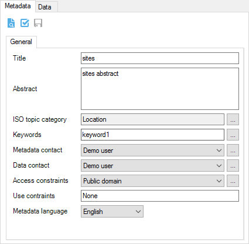
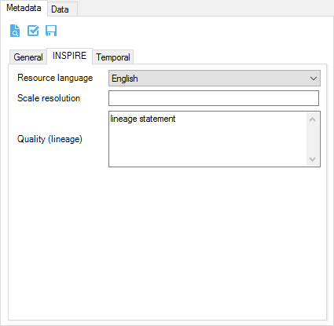
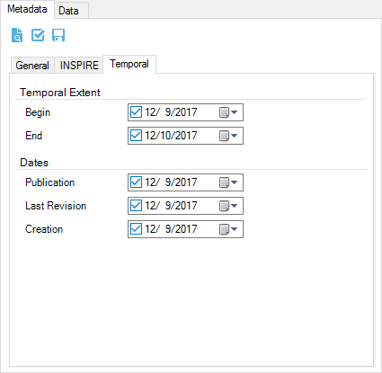
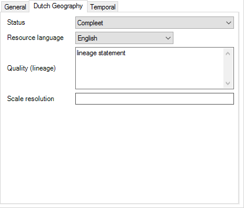
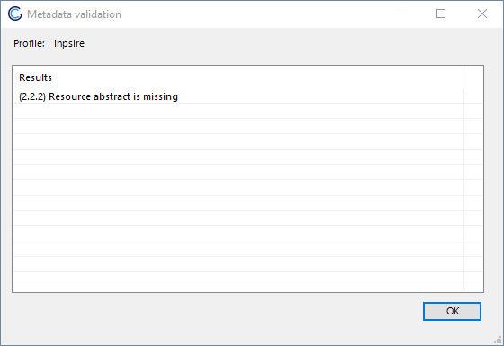

Metadata Editing
#################

Bridge provides a basic editor for metadata properties to create
ISO19139 metadata records. The purpose of this editor is to easily
complete a minimal subset of required metadata elements.

-   Title
-   Abstract
-   ISO topic category
-   Keywords
-   Metadata contact
-   Data contact
-   Access constraints (used for data license)
-   Use constraints (also known as Fees)
-   Metadata language

The Bridge metadata editor can handle both the ESRI metadata formats and
the ISO19139 format. When publishing metadata to GeoNetwork, Bridge will
convert the metadata to ISO19139 format when the metadata is stored in
the ESRI format.

## Profiles

The Premium version provides support for the following metadata
profiles.

-   Default (ISO19139)
-   INPIRE
-   Dutch Geography v1.3.1

### Default

### INSPIRE

The INSPIRE profile has two additional panels to edit metadata.

### Dutch Geography v1.3.1

The Dutch Geography v1.3.1 profile has two additional panels to edit
metadata.

## Preview metadata

To show a preview of the metadata of the selected layer, click on
.

If the data has been published to map and/or catalogue server, the
preview page will show a link to the metadata record in the catalogue
server and a link to a preview page of the WSM layer.

## Metadata validation

Bridge has schematron validation for the supported metadata profiles.
Schematron validation checks the content of the metadata file for
required properties of the selected metadata profile. To perform
metadata validation on a layer metadata, click on
 in the layer metadata panel. After validation
a form with validation results is displayed.

