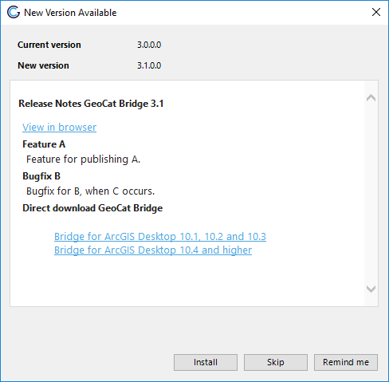

# Application Update

In QGIS updates of the plugin are managed via the plugin managed, incidentally click "update plugin" to receive latest updates.

In ArcMAP, Bridge checks automatically the first time of the
working session. If a new version is available, the
*GeoCat Bridge updater* window is shown.

You can open this window manually by selecting the option *Help \> Check
for updates* in the toolbar.

-   Click button *Install* to install the update
-   Click button *Skip* to ignore new updates
-   Click button *Remind me* to close the window. You will be informed
    about the update the next time you open ArcGIS Desktop® and click
    the Publish wizard icon 

When the downloading of the update is finished, the following message
box is shown.

When you close ArcGIS Desktop® the update process will start.

It is possible to disable the automatic check in settings.
