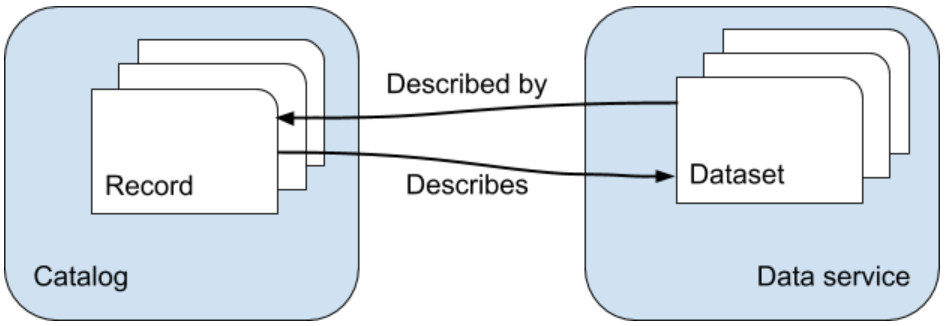

Background
###########

When publishing data on the Internet it is a common practice to provide
the data using standardized exchange protocols. Adopting standards
facilitates a wide usage of the data. In the geospatial domain the OGC
and ISO TC211 data exchange standards are the industry standards, and
for example required by the European INSPIRE regulations. The Bridge
extension takes care of exporting your map, data, styles and metadata to
opensource mapping platforms that provide data exchange and catalog
services that comply with these standards. Bridge will properly link service and metadata and vice versa, so users can easily bind to a service from a catalog search result or find the relevant metadata for an exposed dataset.

Serverside software components currently supported by Bridge are GeoServer, MapServer, 
GeoNetwork Opensource. Some options are available to migrate data to and expose data from PostGIS.

You can also choose to save the metadata and map symbology on your computer as files or in a GeoPackage so you can use them to publish on other software platforms
(deegree, QGIS).

Supported components and formats
==================================

`GeoServer  <http://geoserver.org/>`_ is the reference implementation of
the Open Geospatial Consortium (OGC)_ Web Feature Service (WFS) and Web
Coverage Service (WCS) standards, as well as a high performance
certified compliant Web Map Service (WMS). GeoServer has a REST api, which can be used to configure featuretypes. Bridge uses this API to publish data. Geoserver internally uses `SLD <https://www.opengeospatial.org/standards/sld>`_ to define the visualisation of data layers.

`MapServer <http://mapserver.org>`_ is an Open Source platform for
publishing spatial data and interactive mapping applications to the web.
Originally developed in the mid-1990's at the University of Minnesota,
MapServer is released under an MIT-style license, and runs on all major
platforms (Windows, Linux, Mac OS X). Mapserver services are defined by `map files <https://www.mapserver.org/mapfile/>`_, these configuration files can be generated by Bridge.

`GeoNetwork Opensource <http://geonetwork-opensource.org>`_ is a catalog for registering 
spatial assets, such as datasets. It contains a CatalogService for the Web (CSW) 
endpoint. GeoNetwork can operate on various metadata models via a plugin mechanism. It
supports ISO19115-3, ISO19139, ISO19110 and DCAT metadata standards. GeoNetwork
Opensource software complies with the requirements of INSPIRE discovery services and metadata.

GeoStyler-style is a styling format used in the `Shogun framework <https://github.com/terrestris/shogun-core>`_. Geoserver also has a `plugin <https://docs.geoserver.org/latest/en/user/community/geostyler/index.html>`_ that allows to style layers using GeoStyler-style. Bridge uses this format internally as an intermediate format, but it can also be exported to be used directly.

`Mapbox Style <https://docs.mapbox.com/mapbox-gl-js/style-spec/>`_ is a style format that defines the visual appearance of vector tiles in the `mapbox javascript api <https://docs.mapbox.com/mapbox-gl-js/api/>`_. Bridge is able to generate a mapbox style document.

`PostGIS <http://postgis.org/>`_ is a spatial extension to the popular open source postgres database. Bridge is able to export any local data to a remote (or local) postGIS database. That data can then be used to set up data services.

