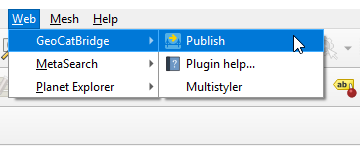

The Bridge dialog
=================

All the interaction with Bridge is done through the Bridge dialog. To open it, select the `Publish` button under the `Web/GeoCat` menu.

The first time you open the Bridge dialog, you will see a landing page with information about Bridge and other GeoCat products. Follow the corresponding links to know more about these products and how they can be used along with Bridge.

The Bridge dialog contains three sections:

- Publish
- Server
- GeoCat

We will see all of them in detail in the following pages.