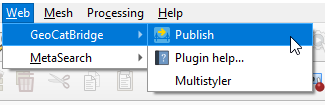
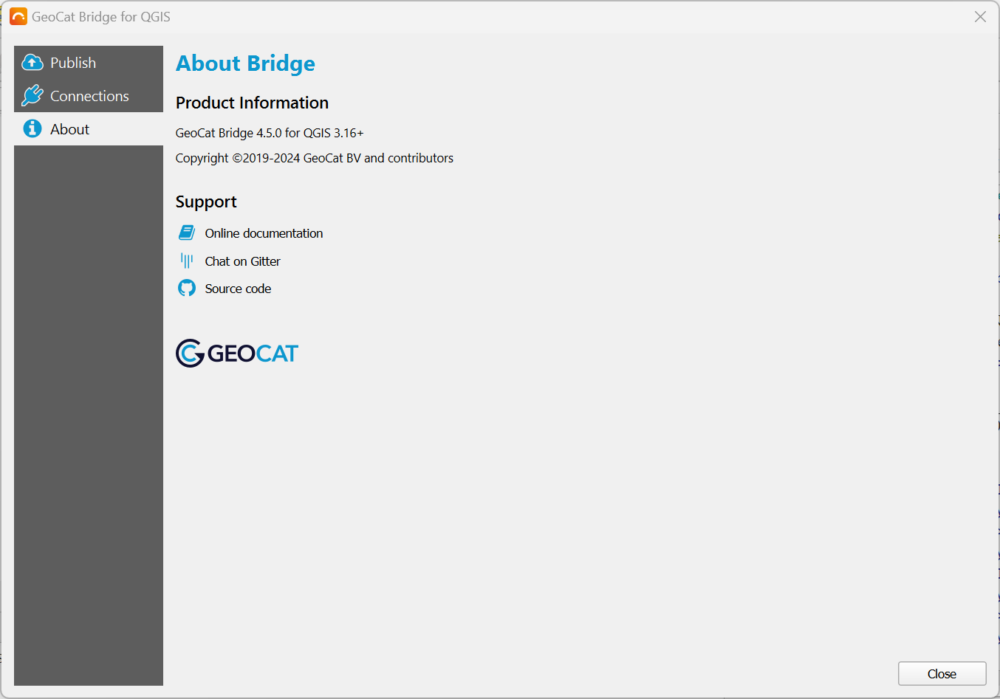

The |short_name| Dialog
=======================

Most of the interaction with |app_name| is done through the |short_name| dialog.
To open it, select the `Bridge Publisher` button on the `Web toolbar` or look for it under the |menu_name| menu.

The first time you open the |short_name| dialog, it should display the `About` panel that shows some information
about your current |short_name| version, and contains some useful links.

As you can see, there are 2 more panels besides the `About` panel mentioned above:

- Publish
- Connections

We will have closer look at these panels on the following pages.

Logging and error handling
--------------------------

| If you are experiencing unexpected behavior, you should open the |app_name| log message panel to find out if |short_name| has been logging some errors or warnings.
| This panel can be opened by clicking the "balloon" button in the lower-right corner of QGIS
  or by checking the :guilabel:`View` > :guilabel:`Panels` > :guilabel:`Log Messages` item from the QGIS menu bar.

In some (rare) occasions, |short_name| might raise an exception. When this happens, a dialog pops up with a Python stack trace.
If you keep experiencing the same error, please press the :guilabel:`Send Report` button. This will open your browser with a web form,
where you can (optionally) describe the problem and send the error report to the |short_name| developers, so they are aware and can fix it.

Internationalization (i18n)
---------------------------

|app_name| is primarily targeted towards an international audience, which means that it has an English user interface.
However, some basic translations are available for the following languages:

- Dutch (Nederlands)
- German (Deutsch)
- Spanish (Español)

| The translations will be applied automatically based on the language settings of the user.
  If no translation can be found for a certain text, the original text (English) will be displayed instead.

If you would like to contribute to the translations, please join the |short_name| `Transifex project <https://explore.transifex.com/geocat/bridge-common>`_.
