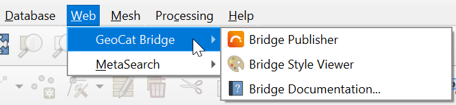

The |short_name| Dialog
=======================

Most of the interaction with |app_name| is done through the |short_name| dialog.
To open it, select the `Publish` button on the `Web toolbar` or look for it under the |menu_name| menu.

The first time you open the |short_name| dialog, you will see a landing page with information about
|short_name| and other |publisher| products. Follow the corresponding links to find out more about these
products and how they can be used with |short_name|.

.. tip::   At the bottom of the `About` panel, it should display the |app_name| version that you are currently running.

As you can see, there are 2 more panels besides the `About` panel mentioned above:

- Publish
- Servers

We will have closer look at these panels on the following pages.

Logging and error handling
--------------------------

| If you are experiencing unexpected behavior, you should open the |app_name| log message panel to find out if |short_name| has been logging some errors or warnings.
| This panel can be opened by clicking the "balloon" button in the lower-right corner of QGIS
  or by checking the :guilabel:`View` > :guilabel:`Panels` > :guilabel:`Log Messages` item from the QGIS menu bar.

| In some (rare) occassions, |short_name| might raise an exception. When this happens, a dialog pops up with a Python strack trace.
| If the error re-occurs, please press the :guilabel:`Send Report` button, so that we're aware of the issue and can try fixing it.

Internationalization (i18n)
---------------------------

|app_name| is primarily targeted towards an international audience, which means that it has an English user interface.
| However, some rudimentary translations are available for the following languages:

- Dutch (Nederlands)
- German (Deutsch)
- Spanish (Español)

| The translations will be applied automatically based on the language settings of the user.
  If no translation can be found for a certain text, the original text (English) will be displayed instead.