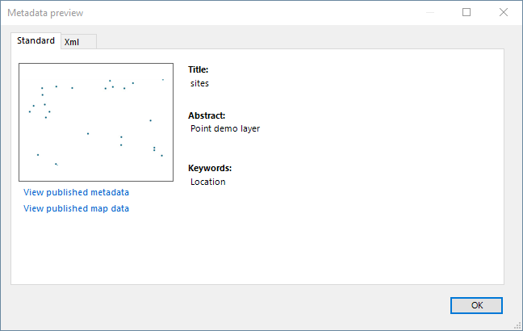
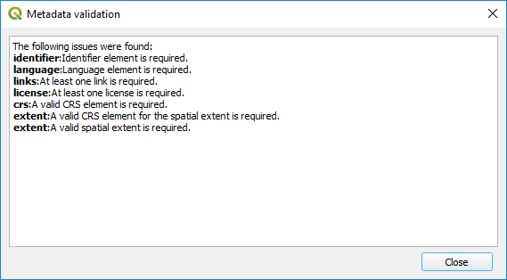

.. _MetadataEditing:

Metadata Editing
================

Bridge provides a basic editor for metadata properties to create
ISO19139 metadata records. The purpose of this editor is to easily
complete a minimal subset of required metadata elements.

-   Title
-   Abstract
-   ISO topic category
-   Keywords
-   Metadata contact
-   Data contact
-   Access constraints (used for data license)
-   Use constraints (also known as Fees)
-   Metadata language

When publishing metadata to GeoNetwork, Bridge will
convert the metadata to ISO19139 format.

You can edit the metadata fields directly or click on the buttons beside each parameter to open the QGIS metadata editor.

Preview metadata
----------------

To show a preview of the metadata of the selected layer, click on the |previewmetadata| button

.. |previewmetadata| image:: ./img/preview_metadata_button.png

You will see the metadata in a new dialog

Metadata validation
-------------------

Bridge can use QGIS built-in validation tools and display the result of metadata validation. Click on the |validatemetadata| button to validate your metadata.

.. |validatemetadata| image:: ./img/validation.png 

After validation a dialog with validation results is displayed.

Load metadata
--------------

If your layer has metadata in ISO format, and that metadata is saved in an additional file, QGIS won't read it (QGIS only has native support for its own `qmd` format), but Bridge can import it. Select the layer in the Bridge dialog and then click on the :guilabel:`Load metadata button` |loadmetadata|

Bridge will look in the folderwhre the layer file is stored, and it will try to find a metadata file named wether `[layer_filename].[extension].xml` or [layer_filename].xml` (that is, fo ra layer stored in `countries.shp` it will search for both `countries.shp.xml` or `countries.xml`). If such a file exist, it will convert it to the QGIS metadata format and load it.

