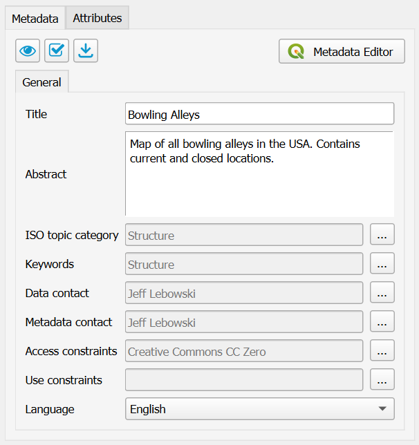
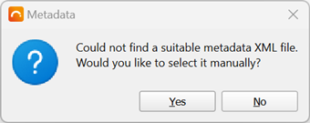

.. _MetadataEditing:

Metadata Editing
================

|app_name| provides a basic editor for metadata properties to create
ISO19139-compliant metadata records. The purpose of this editor is to easily
complete a minimal subset of required metadata elements:

-   Title
-   Abstract
-   ISO topic category
-   Keywords
-   Metadata contact
-   Data contact
-   Access constraints (used for data license)
-   Use constraints (also known as Fees)
-   Metadata language

When publishing metadata to GeoNetwork, |short_name| will convert the QGIS metadata (QMD) into the ISO19139 format.
Note that in order to do that, |short_name| uses the ``lxml`` library, which :ref:`may not be installed <lxml-dependency>`.

| You can edit the |short_name| metadata fields directly, or use the QGIS metadata editor by clicking the :guilabel:`Open QGIS metadata editor` button.
| Note that you can also click the :guilabel:`...` buttons next to each |short_name| metadata field to open the QGIS metadata editor a specific page:

Preview metadata
----------------

To see a preview of the metadata of the selected layer, click the |previewmetadata| button.

This will open a new dialog and render the metadata as a simple HTML webpage:

.. image:: ./img/metadata_preview.png

Metadata validation
-------------------

|short_name| can use built-in QGIS validation tools and display the result of the metadata validation.
Click the |validatemetadata| button to validate your metadata.

After validation a dialog with the results is displayed:

.. image:: ./img/metadata_validation.png

Load metadata
-------------

If your layer has metadata in ISO19139 or ESRI-ISO (ISO19115 or FGDC) format, and that metadata is available in an auxiliary file stored alongside the data file, QGIS will *not* automatically read it.

| QGIS only has native support for its own `qmd` format. However, |short_name| is able to import the metadata.
| Select the layer in the |short_name| dialog and click the |loadmetadata| button.

.. |loadmetadata| image:: ../../geocatbridge/images/import.svg
                  :height: 16 px
                  :width: 16 px

| |short_name| will look in the folder where the layer file is stored and try to find a metadata file named either `[layer_filename].[extension].xml` or `[layer_filename].xml`.
| For example, for a layer data source named `countries.shp`, it will search for both `countries.shp.xml` and `countries.xml`.
  If such a file exists, and it is in one of the supported ISO formats mentioned above, |short_name| will convert it into the QGIS metadata format and import all elements that it could find.
| If no auxiliary metadata file could be found, |short_name| will ask you if you wish to manually select it:

If you click :guilabel:`Yes`, a file dialog will open so you can select the metadata file to import.

.. note::   - Some (non-supported) elements of the original metadata may get lost in the transformation.
            - Changes in the metadata editor will not be saved to the original imported metadata file.
            - Because of a :ref:`dependency <lxml-dependency>`, |short_name| may not be able to import metadata.
              If this is the case, a warning will be displayed.

.. warning::    | **If you wish to persist the imported/edited metadata for another time, it is important that you
                  save the QGIS project before your close the application.**
                | However, within the same QGIS session (i.e. for the time that the application is being used),
                  the metadata for each layer will be memorized.
