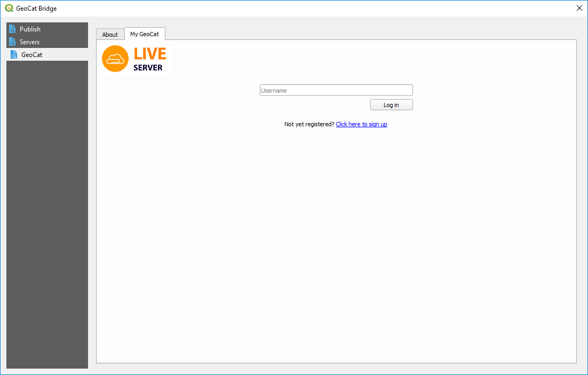
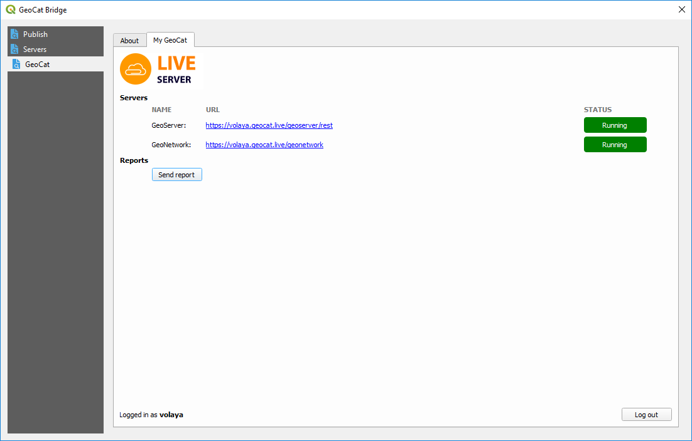
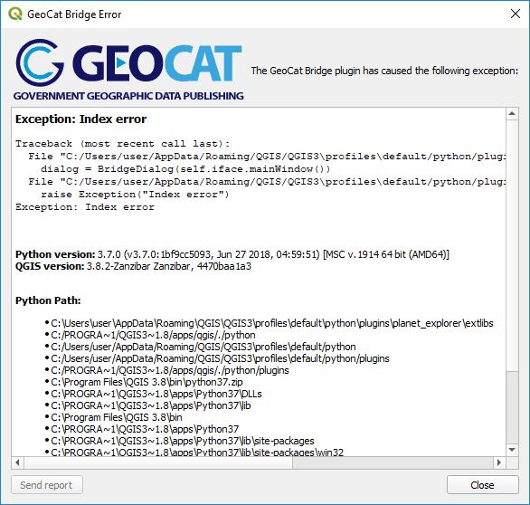

.. _MyGeoCat:

My GeoCat
=========

If you have a GeoCat Live account, you can find additional functionality in the GeoCat section, and moving to the *My GeoCat* tab

Enter your user name and click on *Log in*. You will see detailed information about the data and metadata services provided by your GeoCat Live instance.

When you log in with your user name, Bridge will automatically add a GeoCat Live server to the list of available servers, unless a previous one with that same user name already exists. Notice that it will not set up the corresponding credentials for the GeoServer and GeoNetwork servers, and you will have to manually set that in the *Servers* section of the Bridge dialog.

Reports can be sent by clicking on the *Send report* button.

Whenever Bridge finds an error, it will display the error information in a dialog such as the one shown below:

You can copy the error description in the box by selecting the corresponding text and right-clicking on it. Send it along with your error report, as this will make it easier to find the cause of the error and fix it.
