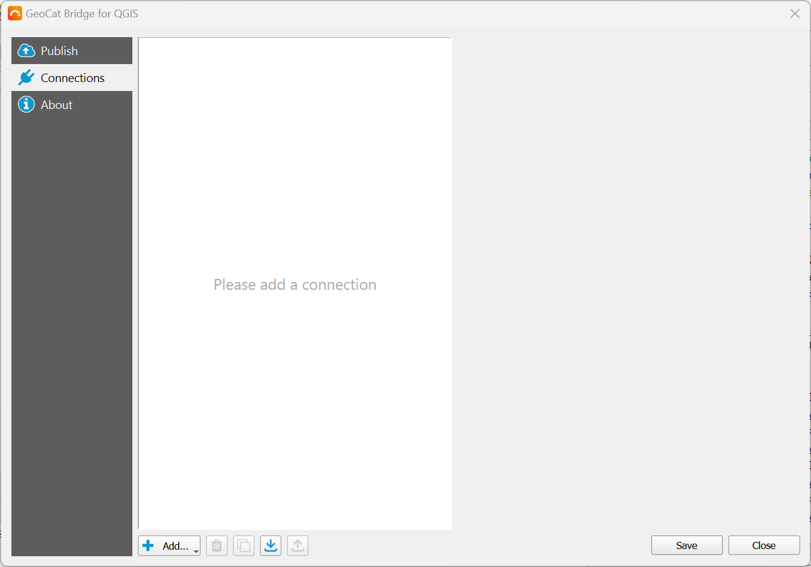
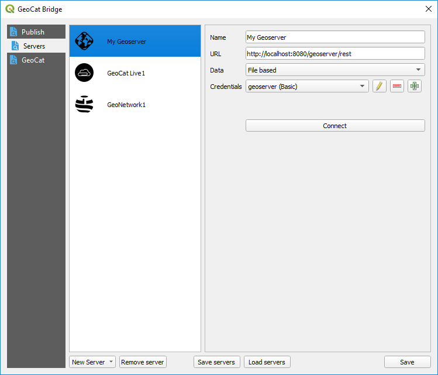
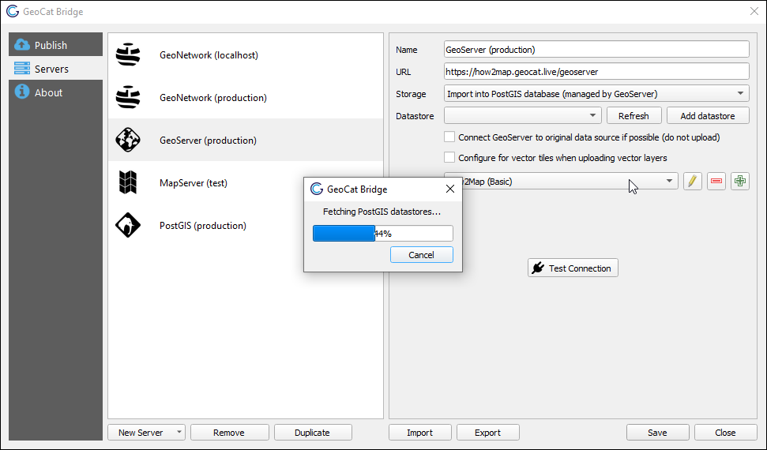

.. _ServerConnections:

Server Connections
==================

Before you can publish data with |app_name|, you will have to configure one or more server connections.
This can be achieved in the :guilabel:`Connections` section of the |short_name| dialog:

Adding connections
##################

.. |addbutton| image:: ../../geocatbridge/images/add.svg
               :height: 16 px
               :width: 16 px

Click |addbutton| **Add...** and choose one of the supported server types to create a new server connection:

- GeoServer
- MapServer
- PostGIS
- GeoNetwork

| Fill in the required parameters and click the :guilabel:`Save` button to store the connection details.
| You can edit the parameters of a server at any given time. Just select the server connection in the left panel, and edit the fields you wish to change in the right panel.

If you wish to remove a server connection, select it from the left panel and click the |removebutton| **Remove** button.
The |duplicatebutton| **Duplicate** button may come in handy if you wish to try out an alternative configuration based on an existing
server connection.

| |short_name| will automatically store all server connections in the QGIS settings for later use.
| However, sometimes you might want to backup or share all the configured server connections. The |exportbutton| **Export** button will
  allow you to *save* a JSON file of the current configuration.
| The |importbutton| **Import** button will do the opposite and *load* server connections from a JSON file. Note that the imported connections will be
  *added* to the list (i.e. no existing connections will be removed). |short_name| will append a numeric suffix to server connections
  with a name that already exists.

Below you can find more info about the different types of services and connections supported by |short_name|.

GeoNetwork
----------

Configure a GeoNetwork connection to publish your metadata to an online catalog (CSW).

.. image:: ./img/servers_geonetwork.png

| You can set a (unique) name to identify the connection, the server URL, and the corresponding credentials (user with publish permissions).
| The default GeoNetwork node is ``srv``, which will be used if you leave the *Node* field empty.

Click :guilabel:`Test Connection` to verify that the connection can be established.

.. _lxml-dependency:

.. note::   | In order to convert the QGIS layer metadata into a format that GeoNetwork understands,
              |short_name| uses the ``lxml`` Python library. This library used to be installed by default,
              but this no longer applies to QGIS 3.22 (LTR) and up, for example.
            | If |short_name| cannot find ``lxml``, it will issue a warning. Therefore, if you wish to publish metadata,
              please install this missing Python package (e.g. using the OSGeo4W setup or Python's pip tool).
            | Users who *only* have to publish *geodata* should *never* have to install this library.

.. _geoserver-setup:

GeoServer
---------

| Configure a GeoServer connection to publish your geodata (layers and symbology) as a map service.
| When you add a new GeoServer connection, |short_name| will automatically add the corresponding WMS and/or WFS endpoints to QGIS, so you can easily add to the server layers to your project, if needed.

| You can set a (unique) name to identify the connection, the server URL, and the corresponding credentials (user with publish permissions).
| The URL can point to the GeoServer base URL (e.g. ``http://localhost:8080/geoserver``) or the REST API URL (e.g. ``http://localhost:8080/geoserver/rest``). Both URLs will work.

If required, you can create and publish Mapbox styles for vector tiles. Mapbox styles and sprite sheets will be processed
after all layers were successfully published to GeoServer.

Click :guilabel:`Test Connection` to verify that the connection can be established.

You also need to specify how the layer data should be stored. Three different storage methods are available:

1. `File-based storage`_
2. `Import into PostGIS database (direct connect)`_ (vector layers only)
3. `Import into PostGIS database (managed by GeoServer)`_ (vector layers only)

File-based storage
^^^^^^^^^^^^^^^^^^

| The layer data is uploaded and stored as files in the GeoServer target workspace datastore.
| |short_name| prefers to upload vector data as GeoPackages and raster data as GeoTIFF files.

This method is the most straight-forward and should always work, as there are no dependencies.
However, depending on the size of the data, this method may be slower and could potentially fail due to network timeouts
or server-side file upload size limitations.

.. _PostGISDirectOption:

Import into PostGIS database (direct connect)
^^^^^^^^^^^^^^^^^^^^^^^^^^^^^^^^^^^^^^^^^^^^^

| The layer data is imported by |short_name| into a PostGIS database directly.
| GeoServer will merely establish a link to the imported database table for the created layer(s). This will require a direct `PostGIS`_ connection, which you can set up in the *Connections* section of |short_name| as well (see below).
| Note that GeoServer should also have read access to that same PostGIS connection.

.. note::   | This method is only available for vector layers.
            | For raster layers, |short_name| will resort to `file-based storage`_ instead.

Import into PostGIS database (managed by GeoServer)
^^^^^^^^^^^^^^^^^^^^^^^^^^^^^^^^^^^^^^^^^^^^^^^^^^^

The layer data is packaged and uploaded to GeoServer, and a job is scheduled on the server to import the data into a PostGIS database.

This is a good approach if you do not have direct access to the PostGIS database from your machine, but GeoServer does.

.. note::   | This method is only available for vector layers.
            | For raster layers, |short_name| will resort to `file-based storage`_ instead.

Please note that some limitations apply:

1. This method requires the GeoServer `Importer extension <https://docs.geoserver.org/stable/en/user/extensions/importer/installing.html>`_ to be installed and enabled.
2. Because Importer can only import vector data from Shapefiles, attribute names may be shortened on export to 10 characters (`.dbf` limitation). Those names will also be applied to the PostGIS table attributes. However, |short_name| will try to make sure that attribute names referenced in styles are renamed accordingly, so the styles won't break.
3. Created PostGIS tables must be deleted manually. Please read :ref:`this warning <ImporterWarning>` for more information.

Datastore selection
+++++++++++++++++++

In the *Import into PostGIS database (managed by GeoServer)* mode, you must either:

- select an existing PostGIS datastore connection on GeoServer that can act as a template;
- or define a new PostGIS connection to use on the GeoServer side.

|short_name| will automatically try to list all available PostGIS datastores on GeoServer.
You can select any datastore as the template that |short_name| should use to create a new datastore with the same connection details as the selected one.

.. note::   | The listed datastores will be prefixed by the workspace name to which they belong.
            | This does **not** mean that the layers will be published to that workspace.

Alternatively, you can click the |addbutton| button to create a new datastore yourself, if you know the connection details.
Note that this is the connection that **GeoServer** should use, and that the connection might not work locally on your machine.

For more fine-grained control, or if you wish to specify a JNDI connection pool instead, please create the datastore in the GeoServer Web UI instead.
|short_name| should then pick up the new datastore automatically, so you can select that as a template.

.. _ImporterWarning:

.. warning::    | Neither the GeoServer REST API nor the Importer extension is authorized to delete underlying PostGIS layer data tables.
                | This means that Bridge also won't be able to clean up these data tables and that each publication will create new tables in the database,
                  adding a numeric suffix to the table name and GeoServer feature type to avoid conflicts. If you (re)publish frequently,
                  this may lead to a lot of redundant tables!
                | Therefore, we recommend creating a clean-up script on the database side that will remove any "orphaned" tables
                  that were created by GeoServer, but are no longer used by any feature type.
                |
                | **Update August 2022**
                | Starting from |short_name| 4.3 and GeoServer 2.21.1, *existing PostGIS tables can now actually be overwritten by the Importer extension*. This should lead to a much cleaner publication process, as there will be less "orphaned" tables.
                | However, please be aware that the Importer extension still cannot delete any PostGIS tables: if a workspace is completely removed, this will not delete the underlying feature type tables.

PostGIS
-------

Configure a PostGIS connection if you wish to upload layer data to PostGIS directly.
Setting up this connection is required when using the :ref:`PostGISDirectOption` in a `GeoServer`_ connection.

.. image:: ./img/servers_postgis.png

.. note::   JNDI connection pool support is currently unavailable.

MapServer
---------

Configure a MapServer connection to publish your map (layer data and symbology).
A MapServer endpoint (Mapfile) is created for each QGIS project.

.. image:: ./img/servers_mapserver.png

Under *Storage*, configure how |short_name| should save the MapServer data.
Choose *Local path* to store all files on the local file system. Choose *FTP service* to transmit the
files over FTP to the online MapServer instance. Depending on which option is selected, you will see some additional parameters that must be configured:

.. image:: ./img/servers_mapserver2.png

Proxies & certificates
######################

The GeoNetwork and GeoServer connections mentioned above communicate with the server over HTTP(S) and all their outgoing traffic is handled by the Python ``requests`` library.
Currently, |app_name| does *not* provide a way to set up a proxy server for these connections, and any QGIS proxy settings that may have been defined are ignored.
There are plans to add proxy support in future QGIS |short_name| releases.

Any QGIS SSL certificate settings are also ignored, which means that |short_name| will *not* be able to connect to servers that use self-signed certificates, for example.
However, there is a workaround to this problem. You could set a system environment variable called ``REQUESTS_CA_BUNDLE`` that points to a *.pem* certificate bundle.
This bundle should include the root certificate and any intermediate certificates that are required to verify the authenticity of the server certificate.
