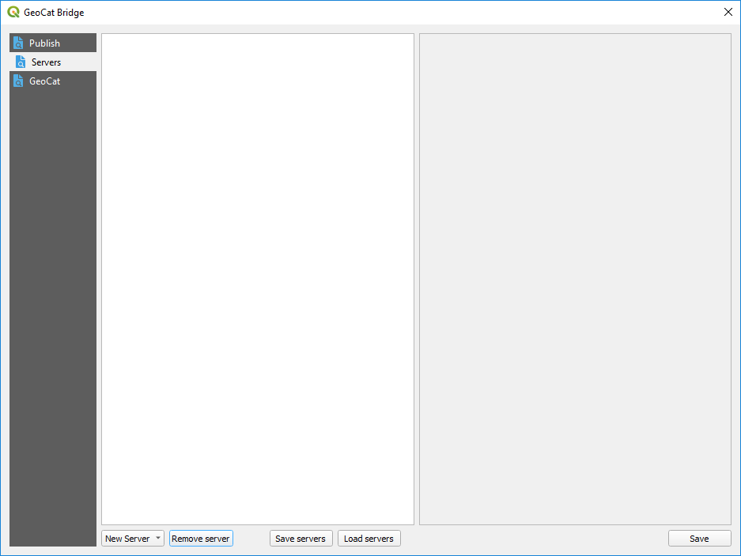
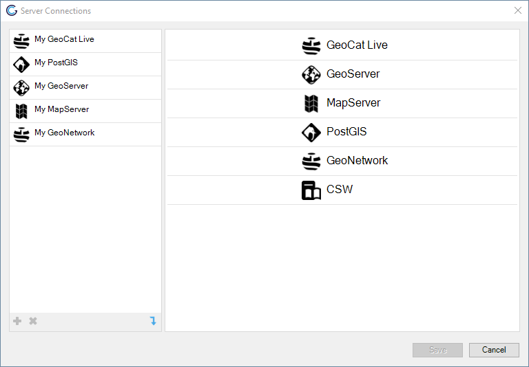
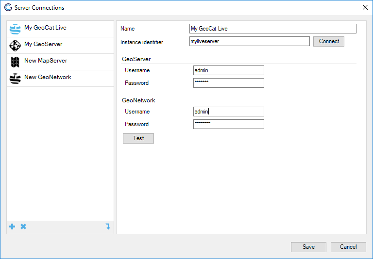
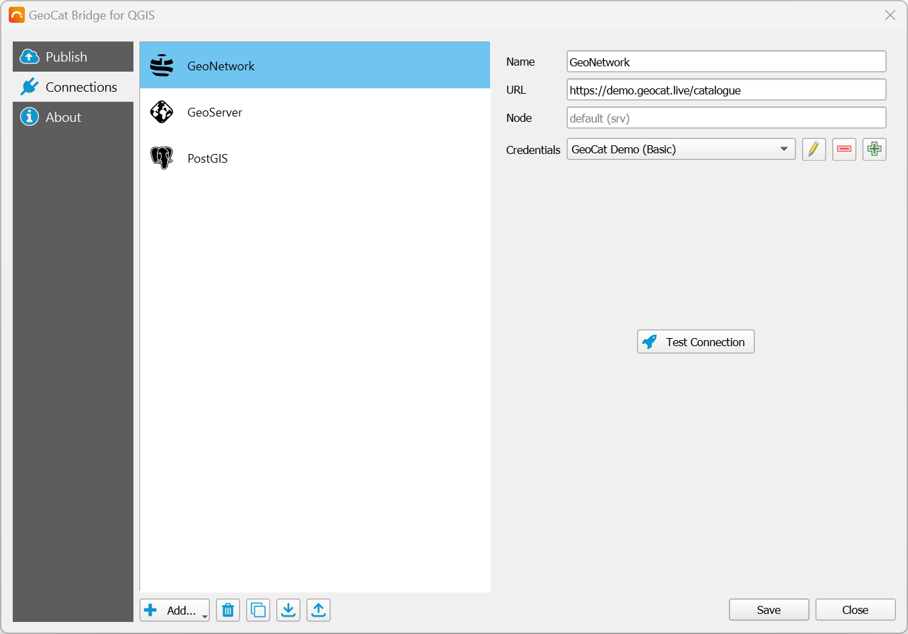
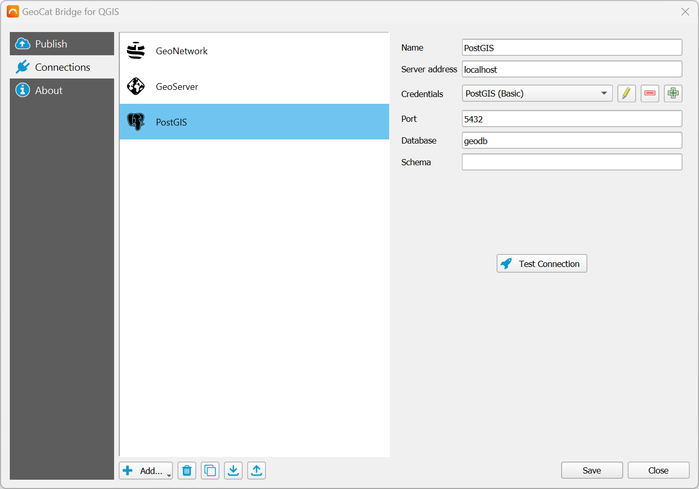
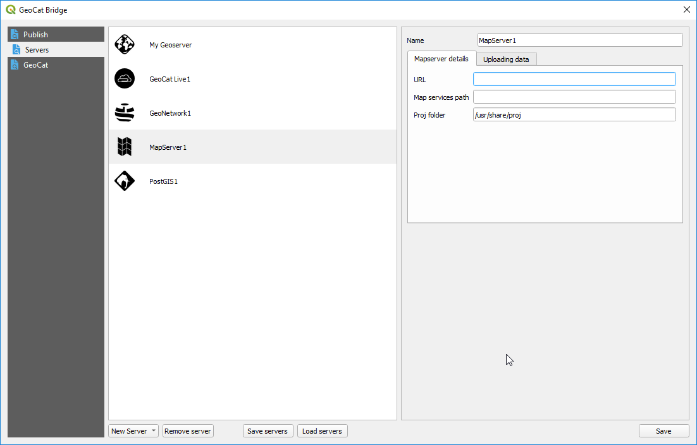
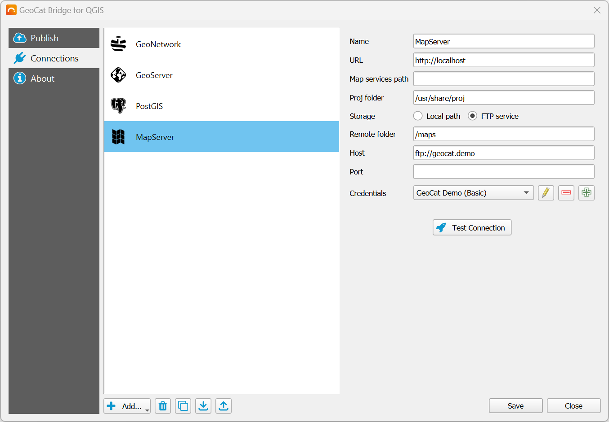

.. _ServerConnections:

Server Connections
==================

Configure your server connections to publish your data and metadata to. To do it, move to the *Servers* section of the Bridge dialog

Add new connection
##################

Click *New Server* and choose one of the supported
server connection types to create a new server:

-   GeoCat Live
-   GeoServer
-   MapServer
-   PostGIS
-   GeoNetwork

Fill the required parameters and then click on the *Save* button to save the server. You can edit the parameters of a given server at anytime, just selecting its name, changing the corresponding values and then clicking on the *Save* button.

Below you can find more detail about the different types of services and connections supported in Bridge.

GeoCat Live
-----------

GeoCat Live is a SDI platform hosted by GeoCat. Depending on your GeoCat
Live configuration Bridge is able to publish metadata to a catalogue
server (CSW) and the layers of the map to a mapserver
(WMS/WFS/WCS/WMTS). Components used

To configure a GeoCat Live connection, enter your Live id and a name for the server. You can then click on 
the *Connect* button to verify that Bridge can connect to the Live instance and retrieve the URLs of the associated data and metadata servers.

When you add a Live server, two new servers will be added to the list of available ones in the *Publish* section: a geodata server and a metadata server.

You don't need to supply the URLs of those servers (as it would be the case if you wanted to manually add each of them), but you must supply their credentials.

GeoNetwork server
-----------------

Configure a GeoNetwork connection to publish your metadata to an online catalogue. 

You must enter a name the URL of the server and the corresponding credentials (with publish permission)

Click *Connect* to test the server connection.

GeoServer connection
--------------------

Configure a GeoServer connection to publish your data to GeoServer.

Provide a name for the server, its URL and the corresponding credentials. 

URL can point to theGeoServer location (i.e. ``http://localhost:8080/geoserver``) or the REST API endpoint (i.e. ``http://localhost:8080/geoserver/rest``)

Finally, you must select how data will be stored in the server. Three different methods are available:

- File based. Files are uploaded to GeoServer and stored in the GeoServer instance.

- Import into a PostGIS DB (handled by Bridge): You must select a PostGIS server to import your data into it. PostGIS servers are defined in the *Servers* section of the Bridge dialog as well, as explained later on in this same chapter. Your layer data is imported into the PostGIS server, and no data is uploaded to GeoServer. GeoServer layers are created pointing to the table that has been created in the selected PostGIS DB, which contains the layer data.

- Import into a PostGIS DB (handled by GeoServer): Layer data is uploaded to GeoServer, and GeoServer itself takes care of importing into the DB. A PostGIS DB must be selected from the datastores available in the GeoServer instance. If you want to add a new one, use the *Add datastore* button.

Bridge and GeoServer workspaces
*******************************

Layers will be published to a workspace with the name of the current QGIS project. If you are trying to publish layers and your current project is not saved yet, you won't be able to start the publication process. A warning message will be shown.

.. image:: ./img/publish_projects_not_saved.png

If the workspace exists, it will be deleted before publishing, so its content after publishing will be just the selected layers and its symbology. If the *Only symbology* option is selected in the publish section, no data is removed before uploading the symbology of the selected layers.

PostGIS connection
------------------

Configure a PostGIS connection to publish your map data to PostGIS. The
PostGIS connection can be used in two different publish scenarios:

1.  Publish only map data to PostGIS
2.  Publish map layers to GeoServer and store data directly in PostGIS
    using a direct database connection (as explained in `GeoServer connection`_)

MapServer connection
--------------------

Configure a MapServer connection to publish your map data to PostGIS. A mapserver
endpoint (mapfile) is created for each QGIS project.

In the *MapServer details* enter the information about your MapServer instance, to which you want to publish.

In the *Uploading data* tab configure how Bridge stores data for your
MapServer connection. Choose *Local path* to store the files in a
location on the local file system. Choose *FTP service* to transmit the
files over FTP to the MapServer server. Depending on which option is selected, you will see additional parameters to configure

