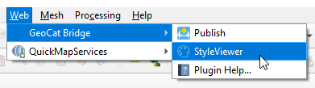
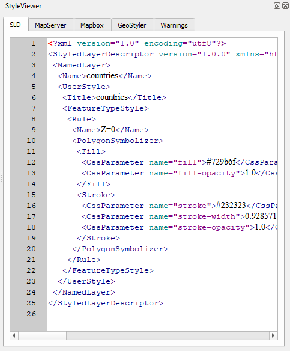

.. _StyleViewer:

StyleViewer Panel
=================

|app_name| offers a way to preview a layer style (symbology) in several different formats using the *StyleViewer*.

You can open the *StyleViewer* panel by clicking :guilabel:`StyleViewer` from the |app_name| menu:

Alternatively, you can open the panel using :guilabel:`View` > :guilabel:`Panels` > :guilabel:`StyleViewer` in the QGIS menu bar.

A dockable panel will now be displayed (initially on the right side of the screen) that looks similar to this:

If you wish to close the *StyleViewer*, click the close button (:guilabel:`x`) in the upper-right corner of the panel
or uncheck the :guilabel:`View` > :guilabel:`Panels` > :guilabel:`StyleViewer` item in the QGIS menu bar.

Currently, *StyleViewer* supports the following style formats:

- SLD (XML): used by GeoServer
- MapServer style (plain text): also known as Mapfile
- Mapbox style (JSON): used for vector tiles
- GeoStyler (JSON)

The *StyleViewer* is context-aware, meaning that it will show style previews for the currently selected layer in the QGIS *Layers* panel:

For more information about how |short_name| handles symbology and which style elements are supported, please read the :ref:`Symbology` section.

.. note::

    - If the layer is not supported by |short_name| (see :ref:`LayerTypes`), nothing will be shown.
    - If there were issues during the style conversion process, these will be displayed on the *Warnings* tab.
